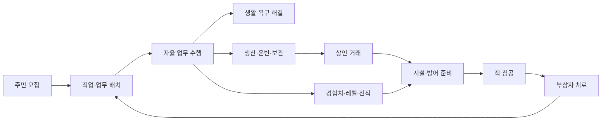

# Game Plan

> 문서 상태: 초안 0.1  
> 작성 기준: 2026-06-22  
> 프로젝트 성격: AI 주민 행동과 정착지 운영을 연구하기 위한 Unity 2D 토이 프로젝트  
> 작성 원칙: 확정되지 않은 내용은 `TBD`로 남기며, 세부 검증 요구사항은 [SPEC.md](./SPEC.md)를 기준으로 한다.  
> 기본 프레임 참고: [게임기획서 기본 문서 양식](https://rockmannetwork.tistory.com/entry/%EA%B2%8C%EC%9E%84%EA%B8%B0%ED%9A%8D-%EA%B2%8C%EC%9E%84%EA%B8%B0%ED%9A%8D%EC%84%9C-%EA%B8%B0%EB%B3%B8-%EB%AC%B8%EC%84%9C-%EC%96%91%EC%8B%9D)

## 1. 게임 개요

### 1.1 게임 타이틀

- 정식 명칭: `TBD`
- 프로젝트명: `NPC_Work_2D`

### 1.2 게임 장르

- 정착지 운영 시뮬레이션
- AI 주민 관리 및 관찰
- 생산·경제·방어 요소가 결합된 2D 게임

### 1.3 게임 플랫폼

- 개발 환경: Unity 2D
- 목표 플랫폼: `TBD`
- 입력 방식: `TBD`

### 1.4 게임 설명

플레이어는 서로 다른 스탯과 직업 숙련도를 가진 AI 주민을 모집하고 배치하여 하나의 정착지를 운영한다. 주민은 플레이어가 모든 행동을 직접 명령하지 않아도 자신의 직업과 상태에 따라 업무를 선택하고 수행한다.

주민의 생산 활동은 창고와 상인 거래를 거쳐 정착지의 경제로 이어진다. 주민은 업무를 반복하며 성장하고, 조건을 충족하면 특성 직업으로 전직할 수 있다. 동시에 식사·갈증·피로·무료함 등의 생활 욕구를 관리해야 하며, 충족되지 않은 욕구는 업무 중단과 폭동 위험으로 이어진다.

정착지는 주기적인 적의 침공을 받는다. 병사 주민과 성곽으로 침공을 막고, 부상자와 전투 불능 주민은 병원 또는 치료소에서 회복시켜야 한다. 시청이 파괴되면 게임오버가 된다.

### 1.5 게임의 목표

#### 단기 목표

- 필요한 주민을 모집하고 적합한 직업에 배치한다.
- 주민의 욕구를 해결하여 정상적인 업무 순환을 유지한다.
- 생산물을 확보하고 창고에 보관한다.
- 상인과 거래하여 골드와 필요한 물품을 확보한다.
- 다음 침공에 대비하여 병사와 방어 시설을 준비한다.

#### 중기 목표

- 주민의 직업 레벨을 높이고 특성 직업으로 전직시킨다.
- 생산·물류·생활·방어 시설 사이의 인력 배분을 안정화한다.
- 더 강해지는 적 웨이브를 지속적으로 방어한다.
- 일반 주민과 희귀한 네임드 주민을 조합하여 정착지의 역량을 강화한다.

#### 장기 목표

- 최종 승리 조건: `TBD`
- 장기 정착지 성장 단계와 엔드 콘텐츠: `TBD`

### 1.6 핵심 재미

- 자율적으로 행동하는 AI 주민을 관찰하는 재미
- 주민의 스탯과 숙련도에 맞는 직업을 찾아주는 최적화
- 한정된 인력을 생산·생활·방어에 배분하는 판단
- 운영 결과가 경제와 침공 방어로 연결되는 연쇄적인 시스템
- 고정된 개성을 가진 네임드 주민을 발견하고 영입하는 희소성

## 2. 게임 시스템 디자인

### 2.1 게임 진행 방식

플레이어는 모집소에서 주민을 영입하고 직업과 업무를 배치한다. 주민은 자율적으로 업무와 생활 행동을 수행하며, 그 결과로 생산물·경험치·욕구 변화가 발생한다. 플레이어는 생산물을 거래하고 주민을 성장시켜 반복적으로 강해지는 적의 침공에 대비한다.

### 2.2 주민 모집 시스템

- 주민은 모집소에서 모집한다.
- 모집 시 골드로 이주 정착금을 지불한다.
- 이주 정착금은 후보의 스탯이 높을수록 비싸진다.
- 모집 후보의 생성 수, 갱신 시점과 갱신 방식은 `TBD`다.
- 골드가 부족하면 모집할 수 없다.

#### 일반 주민

- 정의된 범위에서 외모와 개인 스탯이 생성된다.
- 스탯 조합에 따라 적합한 직업과 모집 비용이 달라진다.

#### 네임드 주민

- 모집 후보에 간헐적으로 등장한다.
- 각 네임드 주민은 고정된 외모와 고정된 스탯을 가진다.
- 등장 확률, 중복 영입과 재등장 규칙은 `TBD`다.

### 2.3 주민 AI와 업무 시스템

- 플레이어는 주민의 직업 또는 담당 업무를 배정한다.
- 주민은 현재 상태와 배정된 역할에 따라 수행할 행동을 자율 선택한다.
- 생활 욕구, 목적지 부재, 시설 이용 불가, 부상 등의 상태가 업무보다 우선할 수 있다.
- 플레이어가 개별 행동을 계속 지시하기보다 시스템을 설계하고 결과를 관찰하는 방식을 지향한다.

### 2.4 직업 성장과 전직

- 주민은 유효한 직업 업무를 수행하면 해당 직업 경험치를 얻는다.
- 다음 레벨은 이전 레벨보다 더 많은 경험치를 요구한다.
- 일반 직업은 정해진 최대 레벨 이후 전직 없이는 더 성장하지 않는다.
- 조건을 충족한 주민은 교육 시설 또는 시청에서 플레이어가 전직을 선택한다.
- 전직 주민은 특화 업무를 수행할 수 있다.
- 다른 업무에 차출되면 기존 직업 경험치가 감소할 수 있다.
- 전직 주민은 정해진 최소 레벨 아래로 내려가지 않는다.

### 2.5 스탯 시스템

- 기본 스탯은 최소한 힘, 체력, 인내를 포함한다.
- 일반 주민의 스탯은 허용 범위 안에서 생성된다.
- 스탯은 업무 시간, 생산량, 성공률 또는 품질 등의 성과에 영향을 준다.
- 스탯별 정확한 영향과 계산식은 `TBD`다.

### 2.6 생활 욕구와 폭동

- 주민은 배고픔, 갈증, 피로, 무료함을 가진다.
- 욕구를 해결하지 못하면 불쾌 수치가 상승한다.
- 불쾌 수치가 임계치에 도달하면 주민은 폭동 상태가 된다.
- 폭동 중 주민은 정상 업무를 수행하지 않는다.
- 폭동의 전파, 공격 행동, 진압과 해제 규칙은 `TBD`다.

### 2.7 생산과 물류

- 생산직 주민은 직업과 시설에 맞는 생산물을 만든다.
- 생산물은 주민이 창고로 운반하고 보관한다.
- 공방은 재료를 소비하여 직업별 물품을 제작한다.
- 전직 주민은 전용 시설 또는 업무에서 특화 물품을 제작할 수 있다.
- 창고 용량과 운반 실패 시 처리 규칙은 `TBD`다.

### 2.8 경제와 상인

- 상인은 정해진 날짜 또는 주기에 정착지를 방문한다.
- 플레이어는 창고의 생산물을 판매하여 골드를 얻는다.
- 상인은 일반 물품과 낮은 확률의 전용 물품을 판매한다.
- 골드는 물품 구매와 주민의 이주 정착금 등에 사용한다.
- 가격 변동, 거래 운반과 방문 주기는 `TBD`다.

### 2.9 전투와 방어

- 적은 웨이브 단위로 정착지 외곽에서 침공한다.
- 공격 가능한 병사가 있으면 적은 병사를 우선 공격한다.
- 성곽은 별도 체력을 가진 방어선이다.
- 성곽이 무너져도 현재 웨이브의 모든 적을 처치하면 방어에 성공한다.
- 성곽을 돌파한 적이 시청을 파괴하면 게임오버가 된다.
- 적은 게임 진행에 따라 점차 강해진다.

### 2.10 부상과 치료

- 전투에 참여하는 병사 주민은 특히 부상·전투 불능·사망 위험에 노출된다.
- 다른 주민도 정착지 방어선이 무너진 상황에서는 같은 위험에 노출될 수 있다.
- 부상 또는 전투 불능 주민은 병원 또는 치료소로 이동해 치료받는다.
- 치료가 완료된 주민은 시설에서 나와 회복된 상태로 복귀한다.
- 사망과 치료 가능 상태의 경계, 치료 시간, 수용량, 비용과 필요 자원은 `TBD`다.

### 2.11 주요 건물

| 건물 | 핵심 기능 | 미결정 사항 |
|---|---|---|
| 모집소 | 주민 후보 확인, 이주 정착금 지불, 주민 영입 | 후보 갱신과 네임드 등장 규칙 |
| 식당 | 음식 소비, 배고픔 해결 | 좌석 수, 음식 종류와 식사 시간 |
| 창고 | 생산물과 물품 보관 | 용량, 분류와 운반 규칙 |
| 공방 | 재료를 사용한 직업별 제작 | 하위 설비와 제작 목록 |
| 시청/회관 | 정착지 중심, 성장·전직, 방어 핵심 목표 | 최종 명칭과 세부 기능 |
| 성곽 | 적 침공을 막는 외곽 방어선 | 수리와 돌파 규칙 |
| 병원/치료소 | 부상·전투 불능 주민 치료 | 최종 명칭, 치료 자원과 수용량 |
| 식수 시설 | 갈증 해결 | 건물 종류와 이용 방식 `TBD` |
| 휴식 시설 | 피로 회복 | 건물 종류와 이용 방식 `TBD` |
| 여가 시설 | 무료함 감소 | 건물 종류와 이용 방식 `TBD` |

### 2.12 게임 룰

- 주민은 자신의 상태와 배정된 직업에 따라 자율적으로 행동한다.
- 정상적인 생산을 위해 생활 욕구와 필수 시설이 충족되어야 한다.
- 주민 영입에는 후보별 이주 정착금이 필요하다.
- 생산물은 창고를 거쳐 제작 또는 거래에 사용한다.
- 주민은 업무를 통해 성장하고 전직을 통해 특화된다.
- 병사와 성곽으로 적의 침공을 방어한다.
- 시청이 파괴되면 게임오버다.
- 최종 승리 조건은 `TBD`다.

### 2.13 게임 인터페이스(UI/UX)

#### 주민 정보

- 이름과 일반·네임드 구분
- 현재 직업, 레벨과 경험치
- 개인 스탯
- 생활 욕구와 불쾌 수치
- 현재 행동과 목적지
- 부상, 치료, 전투 불능 등의 상태

#### 모집소

- 후보의 외모와 이름
- 일반·네임드 구분
- 주요 스탯
- 이주 정착금
- 모집 가능 여부와 실패 사유

#### 건물 정보

- 현재 기능 상태
- 이용 중인 주민과 대기 주민
- 관련 재고, 수용량 또는 체력
- 시설 이용 불가 사유

#### 운영 정보

- 현재 골드와 주요 재고
- 현재 날짜와 다음 상인 방문
- 현재 웨이브와 다음 침공 조건
- 업무 중단, 전직 가능, 폭동과 부상 알림

## 3. 캐릭터 및 시나리오

### 3.1 주요 캐릭터 소개

#### 플레이어

정착지의 운영자다. 주민 개개인을 직접 조종하기보다 주민을 모집하고 직업·시설·자원을 관리한다. 플레이어 캐릭터가 게임 공간에 실제로 존재하는지는 `TBD`다.

#### 일반 AI 주민

무작위 외모와 스탯을 바탕으로 서로 다른 적성과 성장 가능성을 가진다. 생활 욕구를 해결하면서 직업 업무를 자율적으로 수행한다.

#### 네임드 AI 주민

고정된 외모와 스탯을 가진 특별 주민이다. 모집소에 드물게 등장하며 일반 주민과 구별되는 수집 및 전략적 가치를 제공한다. 고유 배경 이야기와 대사의 포함 여부는 `TBD`다.

#### 상인

특정 시점에 방문하여 생산물을 매입하고 일반·전용 물품을 판매한다. 외형, 성격, 상인 종류와 개별 상품군은 `TBD`다.

#### 적

정착지 외곽에서 웨이브 단위로 침공한다. 병사, 성곽, 시청 순으로 정착지의 방어 체계를 위협한다. 세력과 침공 동기는 `TBD`다.

### 3.2 스토리 개요(시놉시스)

플레이어는 아직 기반이 부족한 정착지에서 주민을 받아들이고 생활과 생산 체계를 세운다. 각기 다른 능력을 가진 주민들은 일하고 성장하며 정착지의 구성원이 된다. 그러나 정착지는 반복되는 외부의 침공에 노출되어 있으며, 플레이어는 경제 성장과 주민의 삶, 방어 준비 사이에서 끊임없이 우선순위를 정해야 한다.

구체적인 도입부, 적대 세력의 목적, 결말과 최종 승리 조건은 `TBD`다.

### 3.3 배경 설정

- 시대와 세계관: `TBD`
- 정착지가 세워진 이유: `TBD`
- 주민이 이주 정착금을 받고 마을로 오는 사회·경제적 배경: `TBD`
- 상인과 외부 지역의 관계: `TBD`
- 적대 세력과 침공 원인: `TBD`

## 4. 레벨 디자인 설계

### 4.1 진행 구간 목록

현재 게임은 고정 스테이지보다 하나의 정착지가 성장하고 침공 강도가 상승하는 구조를 우선 가정한다.

| 구간 | 목적 | 주요 특징 |
|---|---|---|
| 초기 정착 | 기본 주민과 생존 기반 확보 | 모집, 식량, 창고와 기초 생산 학습 |
| 생산 확장 | 직업 분화와 경제 순환 구축 | 공방, 상인 거래, 주민 성장 |
| 방어 준비 | 병사와 방어 시설 확보 | 전투 인력 배치, 성곽과 치료 시설 준비 |
| 반복 침공 | 운영 안정성과 복구 능력 시험 | 강화되는 웨이브, 부상자 치료, 인력 재배치 |
| 장기 성장 | 전직과 네임드 주민 조합 | 고급 생산과 특화 직업, 최종 목표 `TBD` |

### 4.2 공간 구성 원칙

- 주민이 생활·생산·보관 시설 사이를 실제로 이동할 수 있어야 한다.
- 업무 목적지는 접근 가능한 이동 경로를 가져야 한다.
- 생산 시설과 창고의 거리는 물류 효율에 영향을 줄 수 있다.
- 모집소는 새 주민이 정착지로 합류하는 진입 지점 역할을 한다.
- 병원 또는 치료소는 전투 지역에서 부상자를 이송할 수 있는 위치를 고려한다.
- 성곽은 외곽 방어선, 시청은 최종 방어 목표로 기능한다.
- 건설과 시설 배치 규칙은 현재 `TBD`다.

## 5. 게임 그래픽 아트 디자인

### 5.1 캐릭터 디자인(PC/NPC)

- 일반 주민은 외모 조합을 통해 개체 차이를 표현한다.
- 직업과 전직 상태를 실루엣, 복장 또는 장비로 식별할 수 있어야 한다.
- 네임드 주민은 고정된 외모로 즉시 구별되어야 한다.
- 부상, 전투 불능, 치료 중 상태는 시각적으로 식별할 수 있어야 한다.
- 구체적인 아트 스타일, 해상도와 애니메이션 규격은 `TBD`다.

### 5.2 배경 디자인(BGA)

- 2D 정착지와 외곽 침공 지역을 명확히 구분한다.
- 각 기능 건물은 용도를 알아볼 수 있는 외형을 가진다.
- 성곽과 시청은 방어 진행 상태를 시각적으로 전달한다.
- 시대·문화권·색상 팔레트와 타일 규격은 `TBD`다.

### 5.3 효과 디자인(Effect)

- 생산 완료와 물품 운반
- 레벨 상승과 전직
- 모집 성공과 네임드 주민 등장
- 피격, 부상, 전투 불능과 치료 완료
- 성곽 피해·붕괴와 웨이브 클리어
- 폭동과 욕구 위험 상태
- 구체적인 이펙트 형식과 강도는 `TBD`다.

## 6. 게임 사운드 디자인

### 6.1 배경음악(BGM)

- 평상시 정착지 운영
- 적 침공 경고와 전투
- 웨이브 승리 또는 게임오버
- 음악 스타일과 트랙 수는 `TBD`다.

### 6.2 효과음(SFX)

- 주민 이동과 업무 수행
- 생산, 운반, 창고 보관과 거래
- 주민 모집과 골드 지불
- 전투, 성곽 피해와 붕괴
- 부상자 치료와 퇴소
- UI 선택, 경고와 오류
- 구체적인 사운드 목록과 우선순위는 `TBD`다.

### 6.3 목소리(Voice)

- 보이스 적용 여부: `TBD`
- 적용 시 일반 주민과 네임드 주민의 표현 범위: `TBD`

## 7. 게임 플레이 테스트 계획

### 7.1 플레이 테스트 목표

- 주민이 직접 명령 없이 배정된 업무를 정상적으로 수행하는지 확인한다.
- 플레이어가 주민의 행동 원인과 중단 원인을 이해할 수 있는지 확인한다.
- 생산·창고·거래·모집으로 이어지는 경제 순환이 단절되지 않는지 확인한다.
- 성장과 전직이 주민 선택 및 인력 배치에 의미 있는 차이를 만드는지 확인한다.
- 침공 피해와 병원 치료가 지나치게 빠른 전멸이나 무의미한 복구로 흐르지 않는지 확인한다.

### 7.2 핵심 테스트 시나리오

| ID | 시나리오 | 확인 항목 |
|---|---|---|
| PT-001 | 일반 주민 모집 | 후보 정보, 스탯 기반 비용, 골드 차감과 합류 |
| PT-002 | 골드 부족 상태의 모집 | 모집 차단, 상태 보존과 실패 피드백 |
| PT-003 | 네임드 주민 등장 | 등장 규칙, 고정 외모와 고정 스탯 |
| PT-004 | 생산 업무 전체 흐름 | 업무 선택, 생산, 운반과 창고 반입 |
| PT-005 | 욕구 해결 실패 | 업무 중단, 불쾌 수치와 폭동 전환 |
| PT-006 | 직업 성장과 전직 | 경험치, 레벨 상한, 선택과 특화 업무 |
| PT-007 | 상인 거래 | 판매·구매, 골드와 재고 정합성 |
| PT-008 | 성곽 방어 성공 | 병사 우선 전투와 웨이브 클리어 |
| PT-009 | 성곽 돌파 후 방어 | 민간 주민 위험과 시청 게임오버 조건 |
| PT-010 | 부상자 치료 | 시설 진입, 치료 중 업무 중단, 회복과 퇴소 |

### 7.3 테스트 기록 기준

- 테스트 빌드와 데이터 버전
- 초기 주민·시설·자원 조건
- 사용한 난수 시드
- 수행 절차와 기대 결과
- 실제 결과와 재현 절차
- 밸런스 의견과 기능 결함을 분리한 기록

## 8. 주요 미결정 사항

상세 질문과 요구사항별 영향은 [SPEC.md의 Open Questions](./SPEC.md#11-open-questions)를 기준으로 관리한다. 우선순위가 높은 결정은 다음과 같다.

1. 게임의 최종 승리 조건과 장기 진행 목표
2. 날짜와 웨이브 진행 기준
3. 모집 후보 갱신과 네임드 주민 등장 규칙
4. 이주 정착금 계산식
5. 주민의 사망·부상·전투 불능 구분
6. 치료 시간, 비용, 자원과 병원 수용량
7. 갈증·피로·무료함을 해결하는 시설
8. 건설과 시설 배치의 플레이어 조작 범위
