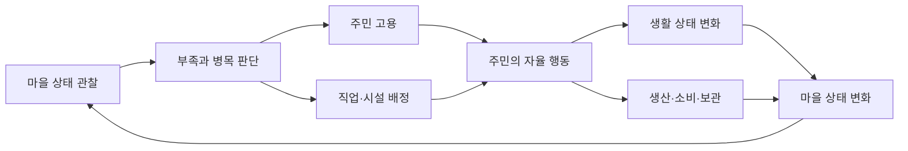

# Project N — Game Plan

> 문서 상태: 핵심 방향 초안 0.2
>
> 개정일: 2026-08-18
>
> 게임 제목: `Project N`(가제)
>
> 프로젝트 성격: 1인 개발 포트폴리오용 소규모 Unity 2D 게임
>
> 문서 목적: 기능을 개별적으로 추가하기 전에 게임의 중심 경험, 범위, 우선순위를 공유한다.

## 0. 문서 사용법

이 문서는 Project N이 **무엇을 위한 게임인지**와 **어떤 순서로 완성할지**를 정하는 최상위 기획 기준이다.

| 문서 | 담당 내용 |
|---|---|
| `Game_Plan.md` | 게임의 비전, 핵심 재미, 범위, 시스템 관계 |
| `PLAN.md` | Phase A~D 구현 순서, 종료 조건, 현재 우선순위 |
| `SPEC.md` | 확정된 기능의 상세 규칙과 검증 조건 |
| `ProjectStructure.md` / `ARCHITECTURE.md` | 코드 책임, 의존 방향, 런타임 구조 |
| `CodeConvention.md` | C# 작성 규칙 |
| `PROGRESS.md` | 실제 구현·검증·차단 상태 |

문서가 충돌하면 게임 의도는 `Game_Plan.md`, 구현 순서는 `PLAN.md`, 현재 코드 상태는 `PROGRESS.md`와 실제 코드를 우선한다. 기존 `SPEC.md`의 상세 항목은 유효한 후보 요구사항이지만, 현재 Phase에 배정되고 기획 상태가 확정된 항목만 구현 대상으로 본다.

기획 항목은 다음 상태를 사용한다.

- `확정`: 구현 기준으로 사용할 수 있다.
- `잠정`: 현재 방향이지만 플레이테스트 결과에 따라 바뀔 수 있다.
- `TBD`: 구현자가 임의로 규칙을 확정하면 안 된다.
- `제외`: 현재 버전에서는 구현하지 않는다.

## 1. 한 문장 정의

> Project N은 서로 다른 능력을 가진 자율 NPC를 고용하고 직업과 시설에 배치하여, 작은 마을이 스스로 살아 움직이고 성장하게 만드는 2D 정착지 운영 게임이다.

플레이어는 주민의 매 행동을 직접 조작하는 지휘관이 아니다. 누구를 고용할지, 어떤 일을 맡길지, 부족한 시설과 자원을 어디에 보완할지를 결정하는 **운영자**다.

## 2. 프로젝트 목표와 규모

### 2.1 제품 목표

- 짧은 설명만으로 핵심 루프를 이해할 수 있는 소규모 완성 게임을 만든다.
- NPC 판단, 행동 실행, 데이터 관리, UI 피드백이 분리된 구조를 포트폴리오로 보여준다.
- 기능 수보다 한 개의 완결된 플레이 루프와 읽기 쉬운 코드를 우선한다.
- 새 직업·행동·아이템을 기존 시스템을 크게 수정하지 않고 추가할 수 있게 한다.

### 2.2 규모 원칙

- 하나의 정착지와 제한된 수의 주민을 다룬다.
- 각 Phase는 독립적으로 플레이하고 검증할 수 있는 수직 슬라이스여야 한다.
- 새 시스템은 현재 Phase의 재미나 완료 조건에 직접 기여할 때만 추가한다.
- 대규모 콘텐츠보다 서로 연결되는 소수의 시스템을 우선한다.

### 2.3 현재 버전에서 제외하는 방향

- 대규모 도시, 수십 종의 직업과 복잡한 기술 트리
- 오픈 월드, 절차 생성 월드, 다중 정착지 운영
- 멀티플레이와 온라인 서비스
- 방대한 스토리 캠페인과 대화 분기
- 복잡한 외교, 세금, 정치 시뮬레이션
- 모든 자원을 물리 오브젝트로 표현하는 대규모 물류 시뮬레이션

위 항목은 장기 아이디어로 보관할 수 있지만 Phase A~D의 완료 조건에는 넣지 않는다.

## 3. 가장 큰 아이디어

### 3.1 핵심 판타지

플레이어는 능력과 상태가 다른 주민을 발견하고 적재적소에 배치한다. 주민은 배정된 역할과 자신의 필요를 바탕으로 스스로 움직이고 일한다. 플레이어의 작은 판단이 주민의 행동, 생산량, 마을의 안정성과 다음 선택으로 이어진다.

### 3.2 핵심 질문

플레이 중 플레이어는 계속 다음 질문에 답해야 한다.

1. 지금 마을에서 가장 부족한 것은 무엇인가?
2. 어떤 주민을 어느 직업에 배치해야 하는가?
3. 주민의 업무가 중단된 이유는 무엇인가?
4. 새 주민, 시설, 자원 중 어디에 먼저 투자해야 하는가?
5. 현재 생산을 유지할 것인가, 다음 위험에 대비할 것인가?

### 3.3 핵심 재미의 네 기둥

#### 주민을 알아가는 재미

주민은 동일한 말이 아니라 서로 다른 스탯, 직업 적성, 성장 상태를 가진다. 플레이어는 주민의 장단점을 파악하고 어울리는 자리를 찾는다.

#### 자율 행동을 관찰하는 재미

주민은 업무, 이동, 식사와 휴식 같은 행동을 스스로 선택한다. 플레이어는 명령을 반복 입력하기보다 시스템이 의도대로 작동하는 모습을 관찰한다.

#### 배치와 우선순위의 재미

한정된 주민을 생산, 생활 유지, 경제, 방어에 나누어 배치한다. 모든 문제를 동시에 해결할 수 없기 때문에 선택에 의미가 생긴다.

#### 원인과 결과를 이해하는 재미

주민이 멈췄다면 이유가 보여야 하고, 플레이어가 배치를 바꾸면 결과가 보여야 한다. 복잡성 자체보다 이해 가능한 연쇄 반응을 지향한다.

## 4. 핵심 게임 루프



최소 플레이 루프는 다음과 같다.

1. 플레이어가 주민과 마을의 상태를 확인한다.
2. 주민을 고용하거나 기존 주민의 직업을 배정한다.
3. 주민이 판단하여 목적지로 이동하고 행동한다.
4. 행동 결과로 자원과 주민 상태가 변한다.
5. 부족, 정체, 성장 또는 위험이 발생한다.
6. 플레이어가 원인을 확인하고 다시 배치하거나 투자한다.

이 루프는 전투가 없어도 재미와 이해 가능성이 검증되어야 한다. 방어 시스템은 루프를 대신하는 별도 게임이 아니라, 이미 만들어진 마을 운영에 압박을 주는 후반 확장이다.

## 5. 하위 아이디어와 시스템

### 5.1 주민

역할: 게임의 중심 단위이자 플레이어가 애착과 운영 판단을 만드는 대상이다.

최소 정보:

- 이름과 식별 정보
- 현재 직업
- 업무에 영향을 주는 소수의 스탯
- 현재 욕구 또는 생활 상태
- 현재 행동과 행동을 선택한 이유
- 정상, 부상 등 업무 가능 상태

설계 원칙:

- 런타임 상태는 주민별로 독립되어야 한다.
- Phase A에서는 소수의 스탯과 욕구만 사용한다.
- 일반 주민의 무작위 생성과 네임드 주민은 Phase C에서 확장한다.

### 5.2 직업, 판단, 행동

역할: 같은 주민이라도 배정에 따라 다른 방식으로 마을에 기여하게 한다.

- 플레이어는 직업 또는 담당 역할을 정한다.
- selector/decision policy는 현재 상태에서 무엇을 할지 선택한다.
- action은 이동, 작업, 식사처럼 한 행동의 실행과 성공·실패·취소를 담당한다.
- 실행 주체는 action의 생명주기와 다음 행동 전환을 일관되게 관리한다.
- 새 직업은 기존 주민 실행 구조를 복사하지 않고 직업별 판단과 필요한 행동을 조합한다.

잠정 직업 구성:

| 직업 | 핵심 역할 | 최초 도입 |
|---|---|---|
| 농부 | 기본 식량 또는 원재료 생산 | Phase A |
| 요리사 | 원재료를 소비 가능한 음식으로 변환 | Phase B |
| 경비 | 마을 방어와 적 대응 | Phase D |

정확한 직업 수와 전직 목록은 `TBD`다.

### 5.3 생활 욕구

역할: 주민을 단순 생산 기계가 아니라 관리해야 할 존재로 만든다.

- Phase A에서는 하나의 대표 욕구만 완결한다. 현재 후보는 배고픔이다(`잠정`).
- 욕구는 시간이 지나거나 행동하면서 변한다.
- 위험 수준에서는 업무보다 해결 행동이 우선될 수 있다.
- 해결 수단이 없으면 주민이 멈춘 이유를 UI에서 확인할 수 있어야 한다.
- 갈증, 피로, 무료함, 불쾌와 폭동은 핵심 루프 검증 후 확장한다.

모든 욕구를 처음부터 동시에 구현하지 않는다.

### 5.4 시설과 목적지

역할: 주민의 행동이 실제 공간과 연결되도록 한다.

- 시설은 업무 또는 욕구 해결을 위한 기능과 목적지를 제공한다.
- 주민은 유효하고 접근 가능한 목적지만 선택해야 한다.
- 목적지나 필수 데이터가 없으면 무한 반복하지 않고 안전하게 실패한다.
- 자유 건설·철거 시스템은 `TBD`다. Phase A~B에서는 미리 배치된 시설을 사용해도 된다.

최소 시설 후보는 작업장, 음식 제공 시설, 창고 또는 공용 재고 지점이다.

### 5.5 자원, 생산, 소비

역할: 주민의 행동을 마을 전체의 상태 변화로 연결한다.

- 생산 행동은 정의된 자원을 만든다.
- 자원은 명확한 소유자와 저장 위치를 가진다.
- 조리는 원재료를 소비해 음식을 만든다.
- 주민은 음식을 소비해 욕구를 해결한다.
- 생산·운반·보관·소비 전후의 총량을 추적할 수 있어야 한다.

복잡한 품질, 내구도, 다단 제작은 현재 범위에서 제외한다.

### 5.6 모집과 배치

역할: 새로운 선택지를 제공하고 마을의 인력 구성을 바꾼다.

- 플레이어는 후보 정보를 보고 주민을 고용한다.
- 고용한 주민에게 직업을 배정하거나 변경한다.
- Phase B에서는 고정된 소수 후보로 루프를 먼저 검증한다.
- Phase C에서 스탯 기반 비용, 무작위 일반 주민, 네임드 주민을 추가한다.

후보 갱신 주기와 네임드 중복 규칙은 `TBD`다.

### 5.7 성장과 경제

역할: 반복 업무에 장기 목적을 주고 모집·시설 투자에 비용을 만든다.

- 유효한 업무는 직업 경험치 또는 숙련도를 제공한다.
- 스탯과 숙련도는 최소 한 가지 관찰 가능한 성과 차이를 만든다.
- 생산물 판매와 물품 구매로 골드가 순환한다.
- 골드는 주민 모집과 선택적 투자에 사용한다.
- 전직은 기본 성장 루프가 재미있다고 확인된 뒤 도입한다.

가격 변동, 복잡한 시장과 다수 상인은 현재 범위에서 제외한다.

### 5.8 위기, 방어, 치료

역할: 안정된 생산 루프에 준비와 인력 재배치의 이유를 제공한다.

- Phase D에서 한 종류의 적과 최소 방어 루프를 만든다.
- 경비 주민은 적을 탐색하고 이동해 공격한다.
- 방어 실패는 주민 피해 또는 핵심 시설 피해로 이어진다.
- 부상자는 치료를 받아 업무에 복귀할 수 있다.
- 게임에는 이해 가능한 패배 조건과 하나의 완료 목표가 있어야 한다.

웨이브 수, 사망 포함 여부, 최종 승리 조건은 `TBD`이며 Phase D 착수 전에 확정한다.

### 5.9 UI와 피드백

UI는 장식이 아니라 자율 AI를 이해하기 위한 핵심 시스템이다.

플레이어는 최소한 다음을 확인할 수 있어야 한다.

- 주민의 직업, 상태, 현재 행동과 선택 이유
- 주민이 업무를 수행하지 못하는 이유
- 핵심 자원의 현재 수량과 증감
- 모집 비용과 배치 가능 여부
- 다음 위험 또는 현재 목표

디버그 정보와 플레이어용 UI는 표현은 달라도 동일한 런타임 상태를 읽어야 한다.

## 6. 플레이어 권한

### 플레이어가 하는 일

- 주민 후보를 비교하고 고용한다.
- 주민의 직업과 담당 시설을 배정한다.
- 자원과 주민 상태를 관찰한다.
- 병목이 생기면 인력 배치 또는 투자를 바꾼다.
- 경제 성장과 위험 대비 사이의 우선순위를 정한다.

### 플레이어가 기본적으로 하지 않는 일

- 주민을 매 순간 직접 이동시킨다.
- 모든 작업을 클릭으로 반복 실행한다.
- action 내부 단계까지 지시한다.
- 이해할 수 없는 내부 수치만 보고 결과를 추측한다.

개별 주민에게 긴급 우선 명령을 내리는 기능은 `TBD`다. 추가하더라도 자율 행동을 대체하지 않는 보조 수단이어야 한다.

## 7. 데이터 관리 방향

CSV, ScriptableObject와 JSON은 하나만 선택하는 대안이 아니라 서로 다른 역할을 가진다.

### 7.1 권장 역할 분담

| 데이터 종류 | 권장 형식 | 이유 |
|---|---|---|
| 아이템, 직업, 레시피, 스탯 계수 같은 표 형식 정적 데이터 | CSV | 대량 편집과 비교가 쉽다. |
| CSV 파일 묶음, Unity 오브젝트 참조, 프로젝트별 설정 | ScriptableObject | Inspector 연결과 에셋 참조에 적합하다. |
| 플레이 중 변하는 주민 상태, 재고, 골드 | 런타임 일반 C# 객체 | 원본 설정 데이터와 실행 상태를 분리한다. |
| 세이브 데이터 | JSON `잠정` | 사람이 읽을 수 있고 버전 마이그레이션을 설계하기 쉽다. |
| 중첩이 깊고 표로 표현하기 어려운 정의 | JSON 또는 별도 ScriptableObject `필요 시` | 구조에 맞는 형식을 선택한다. |

### 7.2 목표 데이터 흐름

```text
CSV TextAsset
  → Catalog ScriptableObject가 파일 참조
    → Loader/Mapper가 파싱·검증
      → ID 기반 읽기 전용 Definition 생성
        → Manager/Factory가 주민과 시스템의 런타임 상태 생성
```

### 7.3 데이터 규칙

- 정적 정의와 런타임 상태를 같은 ScriptableObject에 저장하지 않는다.
- CSV 행은 변경되지 않는 고유 ID를 가진다.
- 다른 데이터는 표시 이름이 아니라 ID로 참조한다.
- 중복 ID, 잘못된 enum, 음수 수량, 누락 참조는 로딩 시 검증한다.
- 밸런스 수치는 action과 selector에 하드코딩하지 않는다.
- 파싱과 검증은 중앙 경계를 통해 수행하고 각 기능이 CSV를 직접 읽지 않는다.
- 데이터 형식을 바꿀 때는 소비 코드보다 먼저 스키마와 마이그레이션 영향을 기록한다.

현재 목표인 “CSV를 ScriptableObject의 TextAsset으로 보관”은 소규모 Unity 프로젝트에 적합하다. JSON으로 전면 교체할 이유는 없으며, 저장 데이터나 복잡한 중첩 정의가 실제로 필요해질 때 제한적으로 사용한다.

## 8. Phase A~D 제품 로드맵

| Phase | 플레이 가능한 결과 | 핵심 시스템 |
|---|---|---|
| Phase A — 살아 움직이는 한 명 | 한 주민이 상태를 판단하고 이동·업무·욕구 해결을 반복하며, 플레이어가 이유와 결과를 확인한다. | NPC 상태, selector, action lifecycle, 이동, 한 직업, 한 욕구, 최소 데이터·디버그 UI |
| Phase B — 최소 마을 | 여러 주민을 고용·배치해 생산→가공→소비가 이어지는 작은 마을을 운영한다. | 모집, 직업 배정, 농부·요리사, 공용 재고, 음식, 기본 운영 UI |
| Phase C — 성장하는 마을 | 주민의 차이와 성장, 거래와 골드가 다음 주민 선택과 투자로 이어진다. | 스탯 성과, 경험치·레벨, 상인·경제, 일반/네임드 후보, 데이터 확장 |
| Phase D — 완성된 게임 | 운영한 마을이 위기를 견디고 명확한 승리 또는 패배에 도달한다. | 경비·전투, 침공, 피해·치료, 목표·게임오버, 밸런스·튜토리얼·마무리 |

상세 작업 순서와 각 Phase의 종료 조건은 [PLAN.md](./PLAN.md)를 따른다.

## 9. 완료된 게임의 최소 모습

Project N의 포트폴리오 버전은 최소한 다음 경험을 처음부터 끝까지 제공해야 한다.

1. 플레이어가 주민을 확인하고 고용한다.
2. 주민을 생산 직업에 배치한다.
3. 주민이 자율적으로 이동하고 일하며 생활 욕구를 해결한다.
4. 생산과 소비 결과가 재고와 UI에 반영된다.
5. 주민의 능력과 성장이 운영 결과에 차이를 만든다.
6. 거래 또는 다른 경제 활동으로 다음 선택을 위한 자원을 얻는다.
7. 생산 인력과 방어 인력 사이에서 선택한다.
8. 하나의 최종 목표를 달성하거나 명확한 조건으로 패배한다.

콘텐츠 양이 적어도 이 흐름이 끊기지 않으면 완성된 소규모 게임으로 본다.

## 10. AI 협업 및 변경 원칙

Claude나 Codex가 기능을 설계·구현할 때 다음 순서를 따른다.

1. 요청한 기능이 어느 Phase와 하위 시스템에 속하는지 확인한다.
2. 관련 항목이 `확정`, `잠정`, `TBD`, `제외` 중 무엇인지 확인한다.
3. `TBD`가 행동 규칙이나 데이터 구조를 바꾸면 구현 전에 사용자 결정을 요청한다.
4. 현재 Phase의 완료에 필요하지 않은 후속 시스템을 함께 구현하지 않는다.
5. 후속 Phase를 막지 않을 최소 인터페이스는 만들 수 있지만, 사용처가 없는 범용 프레임워크는 만들지 않는다.
6. selector는 선택, action은 실행, runner는 lifecycle, 데이터 계층은 수치와 정의를 담당한다.
7. 기능 결과는 UI 또는 디버그 화면에서 원인과 함께 관찰 가능해야 한다.
8. 구현 후 `PROGRESS.md`에 완료 내용, 검증 결과, 남은 문제를 기록한다.

## 11. 우선 결정이 필요한 기획 질문

| ID | 질문 | 결정 시점 |
|---|---|---|
| GD-001 | Phase A의 대표 욕구를 배고픔으로 확정할 것인가? | Phase A 핵심 루프 구현 전 |
| GD-002 | Phase B에서 시설은 고정 배치인가, 플레이어가 건설·배치하는가? | Phase B 설계 전 |
| GD-003 | 목표 주민 수와 화면에 동시에 존재할 최대 주민 수는 얼마인가? | Phase B 성능·UI 설계 전 |
| GD-004 | 고용 비용의 재화와 후보 갱신 방식은 무엇인가? | Phase B 모집 완성 전 |
| GD-005 | 직업 경험치와 레벨이 실제로 바꾸는 첫 성과는 무엇인가? | Phase C 성장 구현 전 |
| GD-006 | 네임드 주민의 핵심 가치는 고정 스탯, 고유 능력, 수집성 중 무엇인가? | Phase C 후보 데이터 제작 전 |
| GD-007 | 침공은 날짜, 운영 단계, 플레이어 선택 중 무엇으로 시작하는가? | Phase D 전투 구현 전 |
| GD-008 | 주민 사망을 포함할 것인가, 부상·전투 불능까지만 사용할 것인가? | Phase D 피해 상태 구현 전 |
| GD-009 | 최종 승리 조건과 한 플레이의 목표 시간은 무엇인가? | Phase D 착수 전 |
| GD-010 | 저장/불러오기가 포트폴리오 빌드의 필수 조건인가? | Phase C 종료 전 |

## 12. 기획 품질 판단 기준

새 아이디어는 다음 질문 중 하나 이상에 명확히 답할 수 있을 때만 현재 로드맵에 넣는다.

- 주민을 더 흥미롭게 선택하거나 관찰하게 만드는가?
- 직업 및 인력 배치에 의미 있는 선택을 추가하는가?
- 원인과 결과를 더 잘 이해하게 만드는가?
- 현재 Phase의 플레이 루프를 완결하는가?
- 포트폴리오에서 코드 구조나 게임 완성도를 명확히 보여주는가?

어느 질문에도 답하지 못하면 좋은 아이디어여도 현재 버전에서는 보류한다.
