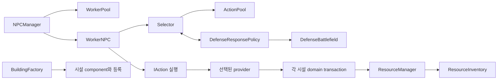

# Code Evaluation Result

## Purpose

게임플레이 production 코드 전체를 사용자가 정한 8가지 기준으로 검수한 결과다. 문서 준수 여부와 문서에 적힌 설계 원칙 자체의 실용성을 별도로 평가했다.

**검수 완료. 이번 변경은 이 보고서뿐이며 코드·씬·프리팹·SO·인터페이스·게임 규칙은 수정하지 않았다.** 아래 결함은 소스와 직렬화 자료로 확인한 것이며, 실제 Play Mode에서 재현했다고 주장하지 않는다.

## Review Snapshot

- 날짜: 2026-10-09 (프로젝트 세션 기준).
- 기준: main `2807fb6e5e39cf6c068b5ad1e6a63aa51cebd432` + 검수 시작 시 존재하던 방어 기능 미커밋 변경 전체.
- 범위: `Assets/Scripts`, `Assets/Data`의 C# **230/230개 전수 읽기**. 상세 목록과 문서 소유권은 부록에 있다.
- 담당: 읽기 전용 A(NPC·판단·실행·전투·이동) 67개, B(시설·건설·주거·경제) 46개, C(조립·진행·UI·지역화) 56개, 루트(계약·값·enum) 61개. 루트는 주요 발견의 호출부·공통 경계·직렬화를 추가 대조했다.
- 문서: ProjectStructure, CodeConvention, ARCHITECTURE, 이전 평가서, 관련 Systems 전체 leaf. Systems 53개 Markdown의 파일 소유 목록을 대조하고 README/이전 경로 안내 문서를 구분했다.
- 추가 확인: DefenseTest/BuildingTest/FarmerTest 및 관련 프리팹·SO의 참조, DefenseSetup의 관련 조립 코드, 기존 검사 코드/결과, TestCameraArrowMove 등 직접 연결된 지원 코드.
- 제외: DOTween 등 외부 라이브러리, Unity 생성물·복구물, Editor/NpcHarness 전체의 자체 설계 검수, 게임 화면·성능 프로파일링. Editor/TestOnly는 production 연결과 검증 근거에 필요한 범위만 확인했다.
- 방법: 코드 읽기, 호출·참조 검색, YAML 대조, 빌드, 분야별 독립 검토의 근거 재확인. 파일 수·줄 수·interface 구현체 수만으로 결함을 판정하지 않았다.

## Executive Summary

**기본 책임 분리는 대체로 유지된다. 우선 해결할 것은 기능 간 수명·요청 계약의 결함이며, 전면적인 구조 재작성은 현재 근거로 권하지 않는다.**

확정 지적은 **High 2건, Medium 4건, Low 4건**이다. Medium에는 현재 기본 플레이에서 트리거를 찾지 못한 예약 API 계약 결함과 잘못된 CSV 입력에 대한 검증 결함도 포함되며, 일반 플레이에서 확인 가능한 코드 경로와 구분한다. 별도의 구조 개선 후보는 확정 결함 수에 포함하지 않았다.

| 사용자가 제시한 기준 | 결과 |
|---|---|
| ① Manager 계층·역할 | 생성·등록·수량·진행 소유권은 대체로 명확하다. Defense의 registry/판단/queue 조립 경계는 정리 후보(C01). Manager 공통 상속 계층을 새로 만들 근거는 없다. |
| ② 유사 역할·중복 | 방어/기존 전투의 병존은 실제 규칙 차이가 있다. 공통 시설 수명 검사는 여러 action에서 일관되게 보장되지 않는다(F01). 미사용 catalog/조회 표면, 반복 action 골격은 제한적으로 정리할 후보다(C03/C05). |
| ③ Inspector 조립 부담 | 대부분 명시적 scene/prefab 연결로 타당하다. 직군 목록의 다중 등록과 파괴 시 내부 component 배열은 변경 동기화 부담이 있다(C02). 숨은 singleton/Find로 대체하지 않는다. |
| ④ 컨벤션·구조 | lifecycle·실패 진단·공유 데이터 공개에 확정 문제(F01/F03/F06/F07/F10)가 있다. 문서 소유권·현재 사실도 일부 뒤처진다(F09). 명명·trace·가변 tuning은 낮은 우선순위 정리(C06). |
| ⑤ 과도한 interface | 전반적인 interface 남용은 확인되지 않았다. IDataManager의 계약은 실제 interface 소비 범위보다 넓다(C03). |
| ⑥ 필요한 interface·계약 부재 | 시설 수명과 요청별 수락 가능성의 계약이 부족하다(F01/F02). 해결은 기존 계약의 작은 확장부터 검토하며 domain마다 interface를 만들지 않는다. |
| ⑦ 여러 목적의 혼합 | DefenseBattlefield와 DefenseResponsePolicy의 변경 이유가 섞인다(C01). WorkerNPC와 ResourceManager가 모든 domain 규칙을 흡수한 형태는 아니다. |
| ⑧ 과도한 세분화 | 메시지·경로탐색·입력 adapter·lease의 분리 이유가 실제로 존재한다. 공통 lifecycle을 모을 여지는 있지만 파일 수 축소 자체를 목표로 하지 않는다(C05). |

## Improvements Since Previous Review

이전 보고서는 2026-09-26의 **Builder 변경 후보만** 검토했고 Unity 배선을 미적용 상태로 기록했다. 이번에는 그 결론을 전체 코드의 품질 보증으로 재사용하지 않았다.

현재는 Builder와 Defense의 실제 씬·프리팹 및 production 연결이 존재하며, 방어 완료 이후의 컴파일·기존 검사 증거도 있다. 부분 queue 대여 실패 반환, 자원 transaction 알림 지연, 단일 HP 소유, 개체별 상태와 공유 정의의 분리는 유지되고 있다. 이번 발견 중 다중 농장·시설 파괴 관련 문제는 이전의 단일 시설·시설 미파괴 가정이 더 넓은 기능에 연결되면서 드러난 경계 문제다.

## Findings By Severity

심각도는 관찰한 결과의 범위와 후속 변경 위험을 기준으로 한다. High는 핵심 진행/시설 규칙을 잘못 실행하는 경로, Medium은 국소 기능 또는 공개 계약·입력 검증 결함, Low는 제한된 lifecycle·진단·설정·문서 문제다. 소스에서 확인한 조건부 실패를 현재 씬에서 발생한 장애로 표현하지 않는다.

### Critical

None found.

### High

#### F01 — 파괴된 시설의 기존 action이 계속 실행될 수 있음

- **근거:** `Assets/Scripts/Actor/BaseInteractionProvider.cs:27`의 CanInteract는 초기화·지원 action·domain 상태만 확인하고 Unity owner의 생존/활성 상태를 보장하지 않는다. `:59`의 TryInteract도 이 검사를 사용한다. `Assets/Scripts/System/Action/BaseWorkingAction.cs:59`, `EatAction.cs:47`, `DrinkAction.cs:48`은 캐시된 interface를 계속 호출한다. `SleepAction.cs:23`은 시설 상태 검사 없이 회복하며 `Assets/Scripts/System/Actor/FarmerActionSelector.cs:263`에서 Sleep에는 시설 capability도 전달하지 않는다.
- **현재 연결:** `Assets/Scripts/Actor/DefenseBuildingDurability.cs:59`는 등록 해제 후 `:74`부터 기능 component를 disable한다. `Assets/Prefab/Defense/SoilDefense.prefab:537`의 목록에 FarmWorkSite가, `RestaurantDefense.prefab:275`에 Pub가 실제로 연결되어 있다. Inn의 기능 해제도 이미 시작된 Sleep에는 전달되지 않는다.
- **상황/영향:** 이동 또는 작업 queue가 생성된 뒤 시설이 파괴되면 신규 선택은 막혀도 기존 action은 남는다. 농사 진행·수확물 지급·음식 효과·여관 회복이 폐허에서도 계속될 수 있다. 주변 위협으로 도주가 먼저 실행되는 경우가 있더라도 모든 대상·시점의 취소를 보장하지 않는다.
- **권고:** 공통 provider 실행 경계에 시설 생존/활성 계약을 보장하고, 캐시된 Unity owner를 안전하게 확인한다. Sleep에도 선택한 시설의 사용 가능성을 전달한다. 정상적인 시설 소실은 재판단으로 처리하고 출입 표현·도구·예약을 정리한다. registry 검색으로 해결하지 않는다.
- **범위/비용/위험:** 중간. interaction, needs/work action, Sleep queue 조립, 관련 leaf. 시작 전·실행 중·완료 직전·잔해 제거 후 및 재사용 회귀가 필요하다.
- **해당 기준:** ②④⑥. 관련 문서의 “시설 파괴 경로가 없음” 가정도 함께 갱신해야 한다(F09).

#### F02 — 다른 작물의 부분 cargo가 수확 실패 반복을 일으킴

- **근거:** `Assets/Scripts/System/Actor/FarmerActionSelector.cs:100`은 Harvest를 Deposit보다 먼저 선택하고 `:187`은 Cargo.IsFull만 검사한다. `Assets/Scripts/System/Inventory/WorkerInventory.cs:34`는 기존 화물과 다른 item ID를 거부한다. `Assets/Scripts/System/Action/HarvestAction.cs:88`은 이 거부를 재판단으로 돌린다.
- **상황/영향:** 긴급 욕구가 없고, 가득 차지 않은 봇짐에 당근을 가진 농부에게 수확 가능한 최근접 밭이 감자 밭이면 수확 거부→같은 밭 재선택을 반복한다. 창고 공간이 있어도 입고 분기에 도달하지 못한다. 실패한 수확에는 욕구 비용도 적용되지 않으므로 자연스러운 탈출을 기대할 수 없다.
- **권고:** 후보의 요청별 수락 가능성을 선택 단계에서 확인하여 호환되지 않는 수확을 건너뛰고 입고로 진행한다. HasAvailableWork와 실제 queue 선택이 같은 판단을 사용해야 한다. Farm 구체 타입을 selector에 노출하기보다 기존 interaction/request와 cargo 조회를 이용하는 최소 계약 확장을 우선한다.
- **범위/비용/위험:** 중간. Farmer 선택·availability 조회와 interaction preflight. 수확 우선순위·부분 수락·긴급 욕구 규칙을 보존해야 한다.
- **해당 기준:** ②⑥. WorkerInventory의 단일 농장 전제와 Farming 문서의 도달 불가 설명은 현재 다중 시설 구조에 맞지 않는다.

### Medium

#### F03 — 닫기 도중 재개한 거래 팝업이 빈 상태로 남음

- **근거:** `Assets/Scripts/UI/PopBase.cs:60`은 activeSelf인 닫기 중 팝업에서 진입 tween만 재생하고 OnOpened를 생략한다. 하지만 `Assets/Scripts/UI/MerchantPopup.cs:108`의 OnBeforeClose는 이미 자원 구독과 판매 세션을 정리했으며, 복원은 `:87`의 OnOpened에만 있다.
- **상황/영향:** 기본 0.25초 닫기 애니메이션 안에 다시 TryShow하면 창 외형만 돌아오고 거래 슬롯·재고 갱신 구독은 복원되지 않는다.
- **권고:** 공통 팝업의 “닫기 취소 후 재열기”를 명시적 lifecycle로 처리한다. 표시 상태와 세션 상태가 일치하도록 복원 지점을 한 곳에 둔다.
- **범위/비용/위험:** 중간. PopBase와 concrete view들의 source 재바인딩·구독·반복 닫기 확인. 모든 popup을 새 framework로 바꿀 필요는 없다.
- **해당 기준:** ②④⑦.

#### F04 — 재고 갱신이 드래그 중인 품목의 identity를 바꿈

- **근거:** `Assets/Scripts/UI/ItemSlotDragHandle.cs:24`는 드래그 시작 시 item ID를 저장하지 않는다. `MerchantPopup.cs:259`, `:299`는 ResourcesChanged 때 재사용 슬롯을 새 offers 순서로 Bind한다. `SellCartDropZone.cs:25`, `:31`은 드롭 순간 슬롯의 현재 ItemId를 사용한다.
- **상황/영향:** 당근 재고가 0이라 감자가 첫 슬롯인 상태에서 감자를 드래그하는 동안 당근이 입고되면 같은 슬롯이 당근으로 재바인딩될 수 있다. 이때 고스트는 감자인데 카트에는 당근이 들어갈 수 있다.
- **권고:** 드래그 시작 시 item ID와 입력 세션을 안정적인 값으로 보관하고 드롭에서 그 값을 사용한다. 닫기·비활성화·취소 시 유효성을 종료한다. 표시 슬롯의 현재 데이터가 입력 중인 transaction의 원본이 되지 않게 한다.
- **범위/비용/위험:** 작음~중간. drag/drop adapter와 팝업 세션 경계. view/drag/drop 스크립트의 분리 자체는 유지한다.
- **해당 기준:** ④⑦⑧.

#### F05 — 오래된 WorkerReservation이 새 예약에 작용할 수 있음 — API 계약 결함

- **근거:** `Assets/Scripts/Manager/NPCManager.cs:21`, `:120`, `:134`, `:167`은 예약을 worker identity만으로 등록·제거한다. `Assets/Data/Struct/WorkerReservation.cs:14`에 발급별 ID/generation이 없다. 취소한 worker는 WorkerPool로 돌아간다.
- **확정 가능한 호출 순서:** A 예약→A 취소→동일 worker로 B 예약→오래된 A를 다시 취소/커밋. 마지막 요청이 B의 등록을 제거하고, B를 반환하거나 A의 예전 role/stat으로 초기화할 수 있다.
- **한계:** 현재 production 호출자에서 취소된 A를 다시 호출하는 실제 트리거는 찾지 못했다. 현재 플레이에서 발생했다고 판정하지 않는다. 문서가 약속하는 중복 호출 안전성이 pool 재대여를 넘어서 성립하지 않는 문제다.
- **권고:** manager가 발급한 예약 identity 또는 generation을 worker와 함께 검증한다. ConstructionReservation의 세대별 소유 검증 원칙을 참고하되 두 domain의 lease를 하나로 합치지는 않는다.
- **범위/비용/위험:** 작음~중간. WorkerReservation·NPCManager·예약 소비자 계약. 정상 commit/cancel, 반복 호출, 재대여 후 stale 요청을 구분한다.
- **해당 기준:** ①④.

#### F06 — item CSV가 부분 실패·중복·비정상 값을 공개함 — 입력 경계 결함

- **근거:** `Assets/Scripts/System/Mapper/ItemInfoCsvMapper.cs:15`는 잘못된 행을 skip하고 부분 테이블을 반환한다. `:40`부터 ID 중복, enum 정의 여부, 효과값의 유한성 확인 없이 현재 culture로 float를 파싱한다. `Assets/Data/ScriptableObject/Script/ItemDataContext.cs:12`는 결과를 캐시해 공개한다.
- **상황/영향:** 같은 ID의 두 행이 있으면 ID 조회와 전체 열거가 서로 다른 의미를 보인다. NaN 효과나 미정의 숫자 category가 통과할 수 있고, 일부 데이터 실패가 전체 초기화 실패로 전달되지 않는다.
- **한계:** 현재 ItemData.csv가 잘못됐거나 현재 재고가 손상됐다는 발견은 아니다. 잘못된 입력을 거부해야 하는 경계와 “검증 성공 후 공유 정의 공개” 원칙의 불일치다.
- **권고:** 다른 Building/Housing mapper처럼 전체 데이터 검증 성공 후 하나의 snapshot을 공개한다. 중복 ID·category·finite 값·문화권 독립 파싱을 확인하고 오류의 행/ID를 반환한다.
- **범위/비용/위험:** 중간. mapper/context와 Pub·자원·UI·기존 fixture의 조회 계약. 외부 소비가 캐시를 바꾸지 못하게 하는 C04와 함께 처리할 수 있다.
- **해당 기준:** ②④⑦.

### Low

#### F07 — 중복 provider의 초기 배선 오류가 조용히 무시됨

`Assets/Scripts/Manager/InteractableManager.cs:78`의 사전 검사에서 충돌 시 false로 반환하므로 `:90`의 중복 로그는 그 충돌에 도달하지 못한다. 초기 BuildRegistry의 `:70`은 반환값도 무시한다. 동일 object/action의 두 provider가 배선되면 두 번째가 오류 보고 없이 빠진다. 현재 정상 씬이 중복 배선됐다는 의미는 아니다.

사전 검사에서 key/provider를 포함해 한 번 진단하고 도달 불가 분기를 정리한다. 첫 등록 보존 의미는 유지한다. 비용·위험 낮음. 기준 ③④.

#### F08 — ActionPool의 Inspector 최대 크기 설정이 적용되지 않음

`Assets/Scripts/System/Lib/ActionPool.cs:8`의 _maxSize는 사용되지 않으며 `:42`의 반환은 항상 enqueue한다. Inspector 값을 바꿔도 보관량이 제한되지 않는다. 실제 메모리 장애나 성능 저하는 측정하지 않았다.

설정 의도를 정해 실제 반환 보관 한도를 적용하거나 의미 없는 필드를 제거한다. Clear는 보관 여부와 무관하게 유지하고, 제거 시 scene 직렬화 영향도 확인한다. 비용 낮음. 기준 ③④.

#### F09 — 소유 문서와 현재 구현에 불일치가 있음

- 주 소유 문서 누락: `Assets/Scripts/UI/BackBg.cs`, `Assets/Data/Class/CONST.cs`.
- 명확한 이중 소유: `Assets/Scripts/System/Lib/CombatLib.cs`가 Combat/Attack_Runtime.md:29와 Targeting_and_Perception.md:40에 모두 주 소유로 등록됨.
- UI.md의 Merchant/TownHall 행은 다른 leaf가 주 소유라고 명시되어 있으므로 이중 소유로 집계하지 않았다.
- Interaction_and_Destinations.md:101의 “시설 파괴 경로가 없어 위험 없음”, Farming/Runtime_and_Transactions.md:109의 다른 품목 cargo 상황 도달 불가 가정은 F01/F02와 충돌한다.
- Merchant_Caravan.md:133의 제거된 _goldManager 배선과 :156의 클릭 관통 미해결 설명은 현재 구현과 다르며, :177의 최신 공유 자원 설명과도 모순된다.
- ARCHITECTURE의 금지 방향에 적힌 “TestOnly -> production gameplay dependency”는 AGENTS/CodeConvention의 “production은 TestOnly에 의존하지 않는다”와 화살표 해석이 반대다.
- policy의 순수성 및 전용 UI의 concrete 참조에 관한 상위 원칙/leaf 예외도 일치시켜야 한다(C01/C03).

보고서 부록에 현재 소유 상태를 보존했다. 후속 관련 수정 시 사실 문서를 정정하고 원칙 수정은 승인된 책임 경계에 맞춰 작성한다. 오래된 구현 가정을 유효한 규칙으로 재사용하지 않는다. 비용 낮음, 기준 ①④.

#### F10 — 상단·새의 component-only disable이 coroutine 수명을 정리하지 못함

`Assets/Scripts/Actor/MerchantCaravan.cs:103`와 `TransportBird.cs:98`은 OnDisable에서 handle만 null로 만든다. GameObject를 켜 둔 채 component만 disable하면 coroutine은 중단되지 않지만 handle/IsVisiting은 사라지므로 이후 실행을 중복 시작하거나 이전 실행을 정리하지 못할 수 있다.

**현재 정상 방문 종료는 GameObject 비활성화이므로 그 경로의 결함으로 확대하지 않는다.** OnDisable에서 실제 실행을 명시 중단하고 관련 표시 상태를 일관되게 정리하는 제한적 수정이 적절하다. TownHallRecruitment의 명시적 StopCoroutine 정리를 참고할 수 있다. 비용 낮음, 기준 ④.

## Findings By File

상세 근거는 위 ID를 기준으로 관리한다. 같은 원인의 action별 증상을 별도 결함으로 중복 집계하지 않았다.

| 주요 파일/영역 | 관련 항목 |
|---|---|
| BaseInteractionProvider, BaseWorkingAction, Eat/Drink/Sleep, FarmWorkSite, DefenseBuildingDurability | F01 시설 수명 |
| FarmerActionSelector, WorkerInventory, HarvestAction | F02 화물 호환성 |
| PopBase, MerchantPopup | F03 재열기 lifecycle |
| ItemSlotDragHandle, SellCartDropZone, MerchantPopup | F04 입력 identity |
| NPCManager, WorkerReservation, WorkerPool | F05 예약 identity |
| ItemInfoCsvMapper, ItemDataContext | F06 데이터 공개, C04 가변 view |
| InteractableManager | F07 진단 누락 |
| ActionPool | F08 무효 설정 |
| CombatLib, BackBg, CONST 및 소유 문서 | F09 문서 소유권 |
| MerchantCaravan, TransportBird | F10 조건부 coroutine 정리 |
| BaseNPCActionSelector, DefenseResponsePolicy, DefenseBattlefield | C01 책임·의존 정리 |
| DefenseBuildingDurability, 모집 설정·생성 entry·모집 card | C02 조립 중복 |
| IDataManager, DataManager, NPCPrefabCatalog | C03 계약·설정 표면 |
| action 공통 골격·표시 행·NPCStat·DestinationDB·tuning 정의 | C05/C06 제한적 정리 |
| FarmProductionDefinition, FarmWorkSite | C07 표현 검증과 gameplay 가용성 |

## Cross-Cutting Findings

### 현재 주요 책임 지도

아래는 주요 호출·조립 관계이며 전체 호출 그래프는 아니다. 양방향 화살표는 실제 Base selector/Defense policy의 상호 호출을 표시한다.

| 상태·규칙 | 현재 주 소유자 |
|---|---|
| action/queue 실행 수명 | WorkerNPC 및 각 action의 실행 상태 |
| 다음 행동·queue 구성 | selector, Defense에서는 DefenseResponsePolicy도 참여(C01) |
| NPC HP·욕구 / 선택 target | NPCStat / CombatRuntimeState |
| 다운·도주·벽 commitment / 이동 경로 | DefenseActor / action별 NPCPathFollower |
| 수량 / 지불·생산·입고 규칙 | ResourceInventory / 각 domain provider |
| 주민 등록 / 집 등록·배정 / 개별 점유 | NPCManager / HousingManager / House·ResidentHousingState |
| pause·GameOver / 웨이브 / 이벤트 | DefenseGameSession / DefenseWaveController / DefenseEventController |
| 공유 값 / 표시 세션 | SO·검증된 정의 / 각 view·presentation adapter |

다음은 **구조 개선 후보**다. 현재 동작 결함, 의도된 설계, 변경 비용을 구분하며 모두 즉시 리팩터링해야 한다는 뜻이 아니다.

### C01 · Medium — Defense 판단·queue·registry 책임을 명확히 정리

`BaseNPCActionSelector.cs:9`의 Defense 전용 대여 wrapper와 `DefenseResponsePolicy.cs:52`의 구체 selector 인수가 Base→Policy→Base 양방향 의존을 만든다. Policy는 target 판단과 action 대여·특수 Init·queue 조립까지 한다. 이는 ARCHITECTURE의 순수 policy 원칙과 Defense 추가 절의 허용 범위가 서로 다른 지점이다.

또한 `DefenseBattlefield.cs:87` 이후에는 등록 조회뿐 아니라 역할별 target 필터·도달 가능한 최근접 벽·8방향 도주 후보 전략(:151)까지 있다. 도주 규칙을 바꾸려면 scene registry를 수정해야 한다.

**권고:** 우선 semantic 판단과 queue 조립의 소유를 일치시킨다. 판단은 응답 값을 반환하고 selector 또는 작은 plain builder가 대여/Init을 수행하는 방향을 우선 검토한다. Battlefield에는 등록·점유·자리 수명을 남기고 역할별 선택 규칙은 판단 계층으로 모은다. 메서드마다 interface나 별도 파일을 만들지는 않는다. 비용 중간, 전투 우선순위·대여 실패 반환·동률 처리 회귀 위험 중간.

### C02 · Medium — 반복되는 Inspector 조립 정보의 응집도 개선

- 직군 추가는 TownHall 모집 설정, NPCManager creation entry, TownHallPopup card에 각각 반영해야 한다. 실제 prefab/scene 및 DefenseSetup.cs:450/:476/:489에서 별도 조립을 확인했다. 서로 다른 runtime 책임은 타당하지만 authoring 정합성 입력은 중복된다.
- DefenseBuildingDurability의 _functionalBehaviours/_functionalColliders/_visuals는 시설 내부 구성을 별도로 나열한다. SoilDefense에는 내부 crop adapter까지 있어 component 추가 시 파괴 목록도 함께 갱신해야 한다. 현재 누락을 발견했다는 의미는 아니다.
- DefenseEventPopup의 Button[]/Text[]는 순서로 대응한다. 같은 항목의 참조는 private serializable row로 묶을 수 있다.

**권고:** 직군의 공통 authoring 식별 목록과 조립 검증을 한 입력에서 파생시키고, 시설은 자기 기능 묶음/중단 경계를 소유하게 한다. popup 버튼/라벨은 같은 row로 묶는다. gameplay Manager를 합치거나 서비스 탐색을 숨기는 방향은 피한다. 비용 중간, prefab/scene migration 필요. 신규 검증 도구 작성은 이번 검수에 포함하지 않았다.

### C03 · Low — 넓지만 실제로 덜 쓰이는 계약·설정 표면

`IDataManager.cs:1`은 item/action cost/building 조회를 함께 제공하지만 production interface 소비자인 MerchantTradeSite는 item 조회만 사용한다. selector와 BuildingPlot은 concrete DataManager를 사용한다. `DataManager.cs:21`의 public static instance는 production 호출이 없고 기존 건설 테스트가 보존/복원만 한다. NPCPrefabCatalog도 현재 WorkerPool의 prefab/capacity 설정과 연결되지 않은 별도 authoring 표면이다.

**권고:** 다음 생성/데이터 수정 때 미사용 singleton과 catalog의 유지 필요성을 정리하고, interface는 실제 item 소비 계약으로 좁히는 방향을 검토한다. 모든 Manager를 일대일 interface로 감쌀 근거는 없다. catalog 미연결은 문서화된 부채이므로 현재 잘못된 prefab이 생성된다고 판정하지 않는다.

상위 문서의 “UI는 항상 concrete 대신 interface”는 **일반 입력/라우팅은 계약에 의존하고, 전용 화면은 자기 domain의 조회·명령 API를 직접 사용할 수 있다**로 구체화하는 편이 현재 구조에 맞다. MerchantPopup→MerchantTradeSite는 가격 규칙을 복제하지 않으므로 interface 부재 결함이 아니다. 비용 낮음~중간.

### C04 · Low — item 공유 캐시의 가변 컬렉션 공개

ItemDataContext.ItemInfos()는 내부 Dictionary/List를 그대로 반환한다. 현재 Pub·WarehousePopup은 읽기만 하므로 실제 외부 mutation을 발견한 것은 아니다. F06을 고칠 때 ID 조회와 read-only category view를 같은 검증된 snapshot으로 제공하는 것이 적절하다. 비용 낮음~중간.

### C05 · Low — 합칠 가치가 있는 공통 부분만 통합

Eat/Drink와 Farming/Harvest의 시간 경과·provider 재확인·결과 처리에는 반복되는 골격이 있다. F01 수정 시 시설 유효성/종료 규칙을 공통 base 또는 작은 helper에 모아 동일 규칙을 여러 곳에서 고치지 않게 할 수 있다. action별 의미와 기존 ActionType 진입점은 유지할 수 있다.

HouseInfoRow/ResourceQuantityRow의 단순 표시 통합은 절약량이 작아 낮은 우선순위다. 반대로 ConstructionReservation과 MaintenanceLease는 다중 공사 자리/종료 사유 대 단일 유지보수라는 차이가 있어 통합을 권하지 않는다. 파일 수 감소를 위한 generic framework를 만들지 않는다. 비용 낮음~중간.

### C06 · Low — 기존 컨벤션·진단·불필요한 할당 정리

- GuardActionCost/FarmingActionCost의 public mutable serialized tuning, DataManager의 CostInfo.actionCost 등은 private serialized/read-only 접근으로 점진 정리 가능하다. 기존 필드명·GUID·enum 값을 보존하거나 migration을 제공해야 한다.
- EatAction/DrinkAction의 private 명명과 임시 duration 표시가 남아 있다. 실행 시간과 판단의 estimated time은 의도가 다를 수 있으므로 값이 같다는 이유만으로 강제로 합치지 않는다.
- NPCStat.cs:90의 무조건 상태 로그와 FarmWorkSite의 정상 작업 trace는 development/tuning gate로 제한하는 것이 적절하다.
- DestinationDB.cs:11/:43은 조회마다 AsReadOnly wrapper를 새로 만든다. 등록 list별 view를 캐시할 수 있다. 할당 존재만 확인했으며 실제 프레임 저하를 측정하지 않았다.
- DataManager.Awake는 _costInfos의 null/항목/중복 key에 대해 명시적인 구성 실패 처리가 부족하다. 현재 배선 오류로 확인한 것은 아니며 초기화 진단 정리 때 함께 다룬다.
- CONST.cs의 COSNT_ASDF는 현재 C# 참조가 없는 placeholder다. 삭제 후보이지 runtime 결함은 아니다.

기능 수정 없이 광범위한 포맷 변경을 먼저 수행할 필요는 없다. 비용 낮음.

### C07 · Low — 생산 유효성과 표현 유효성의 결합 재검토

FarmProductionDefinition.IsValid는 생산 값뿐 아니라 HasValidPresentation도 요구하고 FarmWorkSite는 이를 gameplay 가용성에 사용한다. 현재 leaf가 의도한 설계이므로 구현 위반이 아니다.

이미지/controller 누락만으로 생산 transaction까지 막을 것인지 원칙을 명확히 할 필요가 있다. 단일 definition을 유지하면서 생산 값 검증과 표현 검증을 나누는 방법이 있으며, 검증 때문에 새 SO·interface·script를 여러 개 만들 필요는 없다. 비용 중간, authoring 오류 처리 의미가 바뀌므로 후속 설계 결정 대상으로 둔다.

## Positive Notes

- WorkerNPC는 queue 실행·취소·재평가 hook을 유지하고 역할별 표적 선택이나 시설 transaction을 직접 소유하지 않는다.
- NPCStat의 HP, CombatRuntimeState의 선택 target, DefenseActor의 다운·도주·벽 commitment는 의미가 다르다. 중복 HP 저장소를 확인하지 못했다.
- projectile의 발사 target 고정은 독립 projectile 수명에 필요하다. 기존 AttackAction/GuardAction과 DefenseAttackAction/DefenseStationAction도 피해 시점·투사체·순찰/고정 배치 규칙이 달라 일괄 통합하지 않는다.
- ResourceInventory가 수량을 소유하고 ResourceManager가 조회·알림·용량 제공자를 조정한다. Merchant/Farm/Plot/Maintenance는 각 domain transaction을 소유한다.
- 심기·입고·공사 지불/환급·유지보수는 알림 지연 범위에서 관련 상태를 확정한다. 현재 소비자 경로에서 추가적인 확정 재진입 결함은 찾지 못했다.
- BuildingFactory의 concrete 참조는 조립 책임에 부합한다. NPCManager↔HousingManager의 연결도 곧바로 금지된 정책 순환으로 판정하지 않았다. 주민 등록과 배정의 소유는 구분되어 있다.
- IUIService/IClickPopupSource/IHoverInfoSource, ICombatTarget/IHealthState, INavigationService/INavigationRevision은 실제 소비 경계를 표현한다.
- 메시지 definition/policy/state/Unity adapter, A*의 grid/search/heap, 표시/drag/drop 입력은 각각 변경 이유와 수명이 달라 유지할 분리다.
- MerchantArrivalScheduler는 caravan이 비활성인 동안 살아 있어야 하므로 caravan과 분리하는 것이 타당하다.
- Defense session/wave/event의 상태 소유가 구분되어 있고 UI는 조회와 명령을 소비한다. 검토한 공유 SO에 현재 HP·웨이브·입주자 같은 개체 상태를 저장하는 결함은 확인하지 못했다.
- production C#에서 TestOnly/Harness gameplay 타입에 의존하는 실제 참조는 검색·직접 검토 범위에서 확인되지 않았다. 같은 Assembly-CSharp에 함께 컴파일되는 구조 부채와 구분한다.

## Verification

| 검사 | 결과와 범위 |
|---|---|
| `dotnet build Assembly-CSharp.csproj --no-restore` | 이번 검수에서 실행, exit 0, 오류 0·경고 4. System.Memory/System.Buffers의 MSB3277 참조 충돌이며 firstpass/runtime 프로젝트에서 발생. 코드 경고 0의 Unity 기록과 혼동하지 않는다. 원시 출력은 이번 실행 도구 결과에 있다. |
| 생성 csproj의 Compile Include 대조 | 대상 production C# 230개 모두 포함, 누락 0. 이 이유로 Unity 재컴파일을 추가 반복하지 않았다. |
| 기존 Unity strict compile | 방어 완료의 `.harness-runs/defense-20261009/compile-correction-1.json` 및 scene-work.md 확인. 당시 오류/경고 0. 이번 독립 실행 결과가 아니라 수정되지 않은 소스의 기존 증거로 재사용. |
| 기존 건설·자원 검사 | 같은 기록의 construction-tests.json 15/15, inventory-tests.json 6/6 확인·재사용. |
| 기존 순수 경로·메시지 검사 | navigation-tests.json 1446, message-tests.json 22 확인·재사용. |
| 검사 재사용 근거 | 동일 대화의 방어 완료 이후 검사 입력 코드·에셋을 수정하지 않았고 이번 검수도 읽기 전용이었다. 기존 기록의 검사 범위를 확장하여 전체 gameplay PASS로 해석하지 않는다. |
| 정적 검토 | 230개 파일 읽기, 인터페이스 소비자·Manager 의존·생성/예약·action 수명·transaction·중복 규칙·상수·TestOnly 경계·문서 소유 대조 완료. |
| 직렬화 | 지적의 근거가 되는 시설 기능 disable 목록, 직군 생성/모집/UI 설정, 거래 UI hierarchy, 방어 session/wave/event 연결 확인. 모든 씬의 모든 필드에 대한 자동 검증이라는 뜻은 아니다. |
| diff/보존 | `git diff --check` exit 0. 기존 파일의 CRLF→LF 안내만 있으며 공백 오류 없음. 시작 대비 새 변경 경로는 이 보고서 1개뿐이고 기존 변경 경로는 보존됨. 코드·에셋 수정 없음. |
| Play·화면·프로파일링 | **NOT VERIFIED**. 사용자 작업 원칙에 따라 자동 실행하지 않음. |
| 신규 검증 코드 | 작성하지 않음. 테스트·runner·eval helper·validator 추가 없음. |

분야별 검토자 3명이 통합 보고서의 자기 담당 근거·조건·분류를 다시 확인했다. F02의 긴급 욕구/부분 cargo 조건과 F04의 기존 재고 0 조건을 최종 문구에 반영했다. 이 재검토는 플레이 재현이나 루트 빌드의 독립 실행을 의미하지 않는다.

빌드와 기존 회귀 검사 성공은 F01~F10의 부재를 증명하지 않는다. 특히 시설 파괴 중 action, 다른 품목의 cargo, 닫기 중 재열기, drag 중 목록 변경은 기존 검사 결과로 보장되지 않는 경계다.

## Recommended Next Actions

아래는 후속 수정의 우선순위이며 이번에 실행한 수정 목록이 아니다.

| 순서 | 작업 묶음 | 선행 관계·예상 범위 | 확인할 회귀 시나리오 |
|---|---|---|---|
| 1 | F01 시설 수명 계약 | provider/action/Sleep 조립. 구조 확장 전에 실제 파괴 중단 보장 | 이동 중·작업 중·완료 직전 파괴, 잔해 제거, 생활/작업 종료 표시, pool 재사용 |
| 2 | F02 수확 요청 호환성 | 1의 availability 경계와 일관되게 최소 요청 조회 추가 | 부분 당근+감자 밭+빈 창고, 같은 품목 추가 수확, 가득 찬 cargo/창고, 긴급 욕구, HasAvailableWork 일치 |
| 3 | F03/F04 UI 세션 | domain transaction 변경 없이 입력/view 수명 수정 | 첫 열기, 닫기 중 재열기, source 재바인딩, 입고 중 drag, 팝업 닫기/상단 퇴장 중 drag |
| 4 | F05 예약 identity | 공개 예약 값과 manager 검증 변경 | A 취소→B 재대여→A stale commit/cancel, 정상 중복 호출, 궁수 슬롯/골드 취소 정리 |
| 5 | F06+C04 item 정의 공개 | mapper/context 소비 계약 정리 | 중복 ID, 미정의 category, NaN/Infinity, 잘못된 후반 행, 정상 데이터 전체 조회, 다른 문화권 입력 |
| 6 | F07/F08/F10 제한적 정리 | 진단·pool 설정·coroutine owner. 기능별 작은 수정 | 중복 provider 한 번 진단, pool 반환 보관 한도, GO disable과 component disable의 종료 차이 |
| 7 | C01/C02 구조 개선 | 핵심 결함 수정 후 별도 리팩터링 계획 | Defense 우선순위·대여 실패 반환, 기존 씬 호환, 직군 추가 시 등록 정합성, 시설 adapter 추가 시 파괴 처리 |
| 병행 | F09 및 C03/C05/C06 | 관련 기능을 수정할 때 소유 문서·작은 중복을 함께 정리 | serialized 필드/enum/GUID 보존, production-TestOnly 방향, 기존 소비자 호환 |

위 시나리오는 후속 수정의 확인 항목이다. 자동 Play나 신규 테스트 코드 개발의 승인을 의미하지 않는다. C07의 생산/표현 오류 처리 정책은 기존 의도와 달라질 수 있으므로 기능 수정 계획에서 결정한다.

## Coverage Appendix

전수 읽기는 “모든 조건에서 결함 없음”을 뜻하지 않는다. 각 파일의 기본 검토를 완료했고, 지적 사항은 위 ID에 모았다. 문서 경로는 `PublicMD/` 기준이며 현재 문서의 소유권을 그대로 기록했다. 누락·중복은 F09에 포함한다.

A: 67개 — 전수 읽기 완료

| 파일 | 현재 주 소유 문서 |
|---|---|
| `Assets/Data/ScriptableObject/Script/DefaultActionCost.cs` | `Systems/NPC_Decision_and_Actions/Action_Runtime.md` |
| `Assets/Data/ScriptableObject/Script/DefaultStatContext.cs` | `Systems/NPC_Runtime.md` |
| `Assets/Data/ScriptableObject/Script/DefenseCombatSettings.cs` | `Systems/Defense/Battlefield_and_Response.md` |
| `Assets/Data/ScriptableObject/Script/EnemyStatDefinition.cs` | `Systems/Combat/Enemy.md` |
| `Assets/Data/ScriptableObject/Script/GuardActionCost.cs` | `Systems/Combat/Guard.md` |
| `Assets/Data/ScriptableObject/Script/GuardStatDefinition.cs` | `Systems/Combat/Guard.md` |
| `Assets/Data/ScriptableObject/Script/NPCDecisionTuning.cs` | `Systems/NPC_Decision_and_Actions/Decision_Policy.md` |
| `Assets/Data/ScriptableObject/Script/NPCStatDefinition.cs` | `Systems/NPC_Runtime.md` |
| `Assets/Data/ScriptableObject/Script/TileNavigationProfile.cs` | `Systems/Navigation.md` |
| `Assets/Data/ScriptableObject/Script/WanderActionCost.cs` | `Systems/NPC_Decision_and_Actions/Needs_Actions.md` |
| `Assets/Scripts/Actor/CombatTarget.cs` | `Systems/Combat/Targeting_and_Perception.md` |
| `Assets/Scripts/Actor/DefenseActor.cs` | `Systems/Defense/Battlefield_and_Response.md` |
| `Assets/Scripts/Actor/DefenseProjectile.cs` | `Systems/Defense/Battlefield_and_Response.md` |
| `Assets/Scripts/Actor/NPCDissatisfaction.cs` | `Systems/NPC_Dissatisfaction.md` |
| `Assets/Scripts/Actor/NavigationObstacle2D.cs` | `Systems/Navigation.md` |
| `Assets/Scripts/Actor/TilemapNavigation.cs` | `Systems/Navigation.md` |
| `Assets/Scripts/Actor/WorkerNPC.cs` | `Systems/NPC_Runtime.md` |
| `Assets/Scripts/Manager/DefenseBattlefield.cs` | `Systems/Defense/Battlefield_and_Response.md` |
| `Assets/Scripts/System/Action/AttackAction.cs` | `Systems/Combat/Attack_Runtime.md` |
| `Assets/Scripts/System/Action/BaseBuildingAction.cs` | `Systems/Interaction_and_Destinations.md` |
| `Assets/Scripts/System/Action/BaseWorkingAction.cs` | `Systems/NPC_Decision_and_Actions/Action_Runtime.md` |
| `Assets/Scripts/System/Action/BuildAction.cs` | `Systems/Builder.md` |
| `Assets/Scripts/System/Action/DefaultAction.cs` | `Systems/NPC_Decision_and_Actions/Action_Runtime.md` |
| `Assets/Scripts/System/Action/DefenseAttackAction.cs` | `Systems/Defense/Battlefield_and_Response.md` |
| `Assets/Scripts/System/Action/DefenseStationAction.cs` | `Systems/Defense/Battlefield_and_Response.md` |
| `Assets/Scripts/System/Action/DepositAction.cs` | `Systems/Inventory_and_Items/Cargo_and_Deposit.md` |
| `Assets/Scripts/System/Action/DrinkAction.cs` | `Systems/NPC_Decision_and_Actions/Needs_Actions.md` |
| `Assets/Scripts/System/Action/EatAction.cs` | `Systems/NPC_Decision_and_Actions/Needs_Actions.md` |
| `Assets/Scripts/System/Action/FarmingAction.cs` | `Systems/Farming/Farming_Action.md` |
| `Assets/Scripts/System/Action/FleeAction.cs` | `Systems/Defense/Battlefield_and_Response.md` |
| `Assets/Scripts/System/Action/GuardAction.cs` | `Systems/Combat/Guard.md` |
| `Assets/Scripts/System/Action/HarvestAction.cs` | `Systems/Farming/Farming_Action.md` |
| `Assets/Scripts/System/Action/HomeStayAction.cs` | `Systems/Housing/Life.md` |
| `Assets/Scripts/System/Action/IdleAction.cs` | `Systems/NPC_Decision_and_Actions/Needs_Actions.md` |
| `Assets/Scripts/System/Action/MaintenanceAction.cs` | `Systems/Defense/Durability_and_Maintenance.md` |
| `Assets/Scripts/System/Action/MoveAction.cs` | `Systems/NPC_Decision_and_Actions/Movement.md` |
| `Assets/Scripts/System/Action/SleepAction.cs` | `Systems/NPC_Decision_and_Actions/Needs_Actions.md` |
| `Assets/Scripts/System/Action/WanderAction.cs` | `Systems/NPC_Decision_and_Actions/Needs_Actions.md` |
| `Assets/Scripts/System/Actor/BaseNPCActionSelector.cs` | `Systems/NPC_Decision_and_Actions/Selector_and_Queue.md` |
| `Assets/Scripts/System/Actor/BuilderActionSelector.cs` | `Systems/Builder.md` |
| `Assets/Scripts/System/Actor/CarryVisualPresenter.cs` | `Systems/NPC_Presentation.md` |
| `Assets/Scripts/System/Actor/CombatPerception.cs` | `Systems/Combat/Targeting_and_Perception.md` |
| `Assets/Scripts/System/Actor/CombatRuntimeState.cs` | `Systems/Combat/Targeting_and_Perception.md` |
| `Assets/Scripts/System/Actor/CombatTargetHandle.cs` | `Systems/Combat/Targeting_and_Perception.md` |
| `Assets/Scripts/System/Actor/DefenseArcherSlotLease.cs` | `Systems/Defense/Battlefield_and_Response.md` |
| `Assets/Scripts/System/Actor/DefenseCombatPresentation.cs` | `Systems/Defense/Presentation.md` |
| `Assets/Scripts/System/Actor/DefenseResponsePolicy.cs` | `Systems/Defense/Battlefield_and_Response.md` |
| `Assets/Scripts/System/Actor/DefenseSoldierActionSelector.cs` | `Systems/Defense/Battlefield_and_Response.md` |
| `Assets/Scripts/System/Actor/DissatisfactionState.cs` | `Systems/NPC_Dissatisfaction.md` |
| `Assets/Scripts/System/Actor/EnemyActionSelector.cs` | `Systems/Combat/Enemy.md` |
| `Assets/Scripts/System/Actor/EnemyStat.cs` | `Systems/Combat/Enemy.md` |
| `Assets/Scripts/System/Actor/FarmerActionSelector.cs` | `Systems/NPC_Decision_and_Actions/Selector_and_Queue.md` |
| `Assets/Scripts/System/Actor/GuardActionSelector.cs` | `Systems/Combat/Guard.md` |
| `Assets/Scripts/System/Actor/GuardStat.cs` | `Systems/Combat/Guard.md` |
| `Assets/Scripts/System/Actor/NPCComponent.cs` | `Systems/NPC_Presentation.md` |
| `Assets/Scripts/System/Actor/NPCPathFollower.cs` | `Systems/NPC_Decision_and_Actions/Movement.md` |
| `Assets/Scripts/System/Actor/NPCStat.cs` | `Systems/NPC_Runtime.md` |
| `Assets/Scripts/System/Actor/ProximitySensor2D.cs` | `Systems/Combat/Targeting_and_Perception.md` |
| `Assets/Scripts/System/Lib/ActionPool.cs` | `Systems/NPC_Decision_and_Actions/Selector_and_Queue.md` |
| `Assets/Scripts/System/Lib/CombatLib.cs` | `Systems/Combat/Attack_Runtime.md` / `Systems/Combat/Targeting_and_Perception.md` |
| `Assets/Scripts/System/Lib/DestinationDB.cs` | `Systems/Interaction_and_Destinations.md` |
| `Assets/Scripts/System/Lib/DestinationDecider.cs` | `Systems/NPC_Decision_and_Actions/Decision_Policy.md` |
| `Assets/Scripts/System/Lib/SeededRandomSource.cs` | `Systems/NPC_Decision_and_Actions/Decision_Policy.md` |
| `Assets/Scripts/System/Navigation/AStarOpenSet.cs` | `Systems/Navigation.md` |
| `Assets/Scripts/System/Navigation/AStarPathfinder.cs` | `Systems/Navigation.md` |
| `Assets/Scripts/System/Navigation/NavigationAccessService.cs` | `Systems/Navigation.md` |
| `Assets/Scripts/System/Navigation/NavigationGrid.cs` | `Systems/Navigation.md` |

B: 46개 — 전수 읽기 완료

| 파일 | 현재 주 소유 문서 |
|---|---|
| `Assets/Data/ScriptableObject/Script/BuildActionCost.cs` | `Systems/Builder.md` |
| `Assets/Data/ScriptableObject/Script/BuilderWorkDefinition.cs` | `Systems/Construction/Definitions.md` |
| `Assets/Data/ScriptableObject/Script/BuildingDataContext.cs` | `Systems/Construction/Definitions.md` |
| `Assets/Data/ScriptableObject/Script/BuildingDefinition.cs` | `Systems/Construction/Definitions.md` |
| `Assets/Data/ScriptableObject/Script/CropCatalog.cs` | `Systems/Farming/Definition_and_Catalog.md` |
| `Assets/Data/ScriptableObject/Script/DefenseDurabilitySettings.cs` | `Systems/Defense/Durability_and_Maintenance.md` |
| `Assets/Data/ScriptableObject/Script/FarmProductionDefinition.cs` | `Systems/Farming/Definition_and_Catalog.md` |
| `Assets/Data/ScriptableObject/Script/FarmingActionCost.cs` | `Systems/Farming/Farming_Action.md` |
| `Assets/Data/ScriptableObject/Script/HousingDataContext.cs` | `Systems/Housing/Definitions.md` |
| `Assets/Data/ScriptableObject/Script/ItemDataContext.cs` | `Systems/Inventory_and_Items/Item_Data.md` |
| `Assets/Scripts/Actor/BaseInteractionProvider.cs` | `Systems/Interaction_and_Destinations.md` |
| `Assets/Scripts/Actor/BuildingPlot.cs` | `Systems/Construction/Plots.md` |
| `Assets/Scripts/Actor/CompletedBuildingFacility.cs` | `Systems/Construction/Facilities.md` |
| `Assets/Scripts/Actor/ConstructionVisual.cs` | `Systems/Construction/Presentation.md` |
| `Assets/Scripts/Actor/DefenseBuildingDurability.cs` | `Systems/Defense/Durability_and_Maintenance.md` |
| `Assets/Scripts/Actor/DefenseFleeSpeech.cs` | `Systems/Defense/Presentation.md` |
| `Assets/Scripts/Actor/DefenseMaintenanceSite.cs` | `Systems/Defense/Durability_and_Maintenance.md` |
| `Assets/Scripts/Actor/DefenseWallSegment.cs` | `Systems/Defense/Durability_and_Maintenance.md` |
| `Assets/Scripts/Actor/FarmSeedSource.cs` | `Systems/Farming/Runtime_and_Transactions.md` |
| `Assets/Scripts/Actor/GuardPost.cs` | `Systems/Combat/Guard.md` |
| `Assets/Scripts/Actor/House.cs` | `Systems/Housing/Occupancy.md` |
| `Assets/Scripts/Actor/HousePopupSource.cs` | `Systems/Housing/UI.md` |
| `Assets/Scripts/Actor/MerchantTradeSite.cs` | `Systems/Merchant_Caravan.md` |
| `Assets/Scripts/Actor/Pub.cs` | `Systems/Interaction_and_Destinations.md` |
| `Assets/Scripts/Actor/WarehouseDepositPoint.cs` | `Systems/Inventory_and_Items/Cargo_and_Deposit.md` |
| `Assets/Scripts/Manager/BuildingFactory.cs` | `Systems/Construction/Facilities.md` |
| `Assets/Scripts/Manager/BuildingPlotRegistry.cs` | `Systems/Construction/Plots.md` |
| `Assets/Scripts/Manager/DefenseMaintenanceRegistry.cs` | `Systems/Defense/Durability_and_Maintenance.md` |
| `Assets/Scripts/Manager/HousingManager.cs` | `Systems/Housing/Occupancy.md` |
| `Assets/Scripts/Manager/ResourceManager.cs` | `Systems/Inventory_and_Items/Shared_Resources.md` |
| `Assets/Scripts/System/Actor/HousingAssignmentPolicy.cs` | `Systems/Housing/Occupancy.md` |
| `Assets/Scripts/System/Actor/MaintenanceLease.cs` | `Systems/Defense/Durability_and_Maintenance.md` |
| `Assets/Scripts/System/Actor/ResidentHousingState.cs` | `Systems/Housing/Occupancy.md` |
| `Assets/Scripts/System/Construction/ConstructionReservation.cs` | `Systems/Construction/Plots.md` |
| `Assets/Scripts/System/Construction/ConstructionState.cs` | `Systems/Construction/Plots.md` |
| `Assets/Scripts/System/Farming/CropVisualAnimator.cs` | `Systems/Farming/Crop_Presentation.md` |
| `Assets/Scripts/System/Farming/FarmCropPresenter.cs` | `Systems/Farming/Crop_Presentation.md` |
| `Assets/Scripts/System/Farming/FarmWorkPhase.cs` | `Systems/Farming/Runtime_and_Transactions.md` |
| `Assets/Scripts/System/Farming/FarmWorkSite.cs` | `Systems/Farming/Runtime_and_Transactions.md` |
| `Assets/Scripts/System/Inventory/ResourceInventory.cs` | `Systems/Inventory_and_Items/Shared_Resources.md` |
| `Assets/Scripts/System/Inventory/WorkerInventory.cs` | `Systems/Inventory_and_Items/Cargo_and_Deposit.md` |
| `Assets/Scripts/System/Lib/CSVParser.cs` | `Systems/Inventory_and_Items/Item_Data.md` |
| `Assets/Scripts/System/Mapper/BuilderWorkCsvMapper.cs` | `Systems/Construction/Definitions.md` |
| `Assets/Scripts/System/Mapper/BuildingDefinitionCsvMapper.cs` | `Systems/Construction/Definitions.md` |
| `Assets/Scripts/System/Mapper/HousingCsvMapper.cs` | `Systems/Housing/Definitions.md` |
| `Assets/Scripts/System/Mapper/ItemInfoCsvMapper.cs` | `Systems/Inventory_and_Items/Item_Data.md` |

C: 56개 — 전수 읽기 완료

| 파일 | 현재 주 소유 문서 |
|---|---|
| `Assets/Data/ScriptableObject/Script/DefenseEventCatalog.cs` | `Systems/Defense/Progression.md` |
| `Assets/Data/ScriptableObject/Script/DefenseEventDefinition.cs` | `Systems/Defense/Progression.md` |
| `Assets/Data/ScriptableObject/Script/DefenseWaveCatalog.cs` | `Systems/Defense/Progression.md` |
| `Assets/Data/ScriptableObject/Script/DefenseWaveDefinition.cs` | `Systems/Defense/Progression.md` |
| `Assets/Data/ScriptableObject/Script/LocalizeData.cs` | `Systems/Localization.md` |
| `Assets/Data/ScriptableObject/Script/NPCPrefabCatalog.cs` | `Systems/Spawning_and_Pooling.md` |
| `Assets/Data/ScriptableObject/Script/NPCThoughtCatalog.cs` | `Systems/NPC_Messages.md` |
| `Assets/Scripts/Actor/MerchantArrivalScheduler.cs` | `Systems/Merchant_Caravan.md` |
| `Assets/Scripts/Actor/MerchantCaravan.cs` | `Systems/Merchant_Caravan.md` |
| `Assets/Scripts/Actor/NPCMessageSource.cs` | `Systems/NPC_Messages.md` |
| `Assets/Scripts/Actor/TemporaryGameOverReporter.cs` | `Systems/Combat/Guard.md` |
| `Assets/Scripts/Actor/TownHallRecruitment.cs` | `Systems/Town_Hall.md` |
| `Assets/Scripts/Actor/TransportBird.cs` | `Systems/Merchant_Caravan.md` |
| `Assets/Scripts/Manager/DataManager.cs` | `Systems/Inventory_and_Items/Item_Data.md` |
| `Assets/Scripts/Manager/DefenseEventController.cs` | `Systems/Defense/Progression.md` |
| `Assets/Scripts/Manager/DefenseGameSession.cs` | `Systems/Defense/Progression.md` |
| `Assets/Scripts/Manager/DefenseInitialRoster.cs` | `Systems/Defense/Progression.md` |
| `Assets/Scripts/Manager/DefenseWaveController.cs` | `Systems/Defense/Progression.md` |
| `Assets/Scripts/Manager/InteractableManager.cs` | `Systems/Interaction_and_Destinations.md` |
| `Assets/Scripts/Manager/LocalizeManager.cs` | `Systems/Localization.md` |
| `Assets/Scripts/Manager/NPCManager.cs` | `Systems/Spawning_and_Pooling.md` |
| `Assets/Scripts/System/Actor/MerchantVisual.cs` | `Systems/Merchant_Caravan.md` |
| `Assets/Scripts/System/Actor/NPCMessageState.cs` | `Systems/NPC_Messages.md` |
| `Assets/Scripts/System/Actor/NPCThoughtSelector.cs` | `Systems/NPC_Messages.md` |
| `Assets/Scripts/System/Actor/TownHallVisual.cs` | `Systems/Town_Hall.md` |
| `Assets/Scripts/System/Lib/WorkerPool.cs` | `Systems/Spawning_and_Pooling.md` |
| `Assets/Scripts/System/Localization/LocalizeCsvParser.cs` | `Systems/Localization.md` |
| `Assets/Scripts/System/Localization/LocalizeKeyValidation.cs` | `Systems/Localization.md` |
| `Assets/Scripts/UI/BackBg.cs` | **누락 — F09** |
| `Assets/Scripts/UI/CartSlotRemoveHandle.cs` | `Systems/Merchant_Caravan.md` |
| `Assets/Scripts/UI/ConstructionChoiceRow.cs` | `Systems/Construction/UI.md` |
| `Assets/Scripts/UI/ConstructionPopup.cs` | `Systems/Construction/UI.md` |
| `Assets/Scripts/UI/DefenseEventPopup.cs` | `Systems/Defense/Progression.md` |
| `Assets/Scripts/UI/DefenseHUD.cs` | `Systems/Defense/Progression.md` |
| `Assets/Scripts/UI/DragGhostView.cs` | `Systems/Merchant_Caravan.md` |
| `Assets/Scripts/UI/FarmGaugeHover.cs` | `Systems/UI.md` |
| `Assets/Scripts/UI/GoldHUD.cs` | `Systems/UI.md` |
| `Assets/Scripts/UI/HouseInfoRow.cs` | `Systems/Housing/UI.md` |
| `Assets/Scripts/UI/HousePopup.cs` | `Systems/Housing/UI.md` |
| `Assets/Scripts/UI/HoverBase.cs` | `Systems/UI.md` |
| `Assets/Scripts/UI/ItemSlotDragHandle.cs` | `Systems/Merchant_Caravan.md` |
| `Assets/Scripts/UI/ItemSlotView.cs` | `Systems/Merchant_Caravan.md` |
| `Assets/Scripts/UI/LocalizeText.cs` | `Systems/Localization.md` |
| `Assets/Scripts/UI/MerchantPopup.cs` | `Systems/Merchant_Caravan.md` |
| `Assets/Scripts/UI/NPCMessageHover.cs` | `Systems/UI.md` |
| `Assets/Scripts/UI/PointerClickRouter.cs` | `Systems/UI.md` |
| `Assets/Scripts/UI/PointerHoverRouter.cs` | `Systems/UI.md` |
| `Assets/Scripts/UI/PopBase.cs` | `Systems/UI.md` |
| `Assets/Scripts/UI/QuantityPromptPanel.cs` | `Systems/Merchant_Caravan.md` |
| `Assets/Scripts/UI/ResourceQuantityRow.cs` | `Systems/Inventory_and_Items/Warehouse_UI.md` |
| `Assets/Scripts/UI/SeedSelectionPopup.cs` | `Systems/UI.md` |
| `Assets/Scripts/UI/SellCartDropZone.cs` | `Systems/Merchant_Caravan.md` |
| `Assets/Scripts/UI/TownHallPopup.cs` | `Systems/Town_Hall.md` |
| `Assets/Scripts/UI/TownHallRecruitCard.cs` | `Systems/Town_Hall.md` |
| `Assets/Scripts/UI/UIManager.cs` | `Systems/UI.md` |
| `Assets/Scripts/UI/WarehousePopup.cs` | `Systems/Inventory_and_Items/Warehouse_UI.md` |

Root: 61개 — 전수 읽기 완료

| 파일 | 현재 주 소유 문서 |
|---|---|
| `Assets/Data/Class/CONST.cs` | **누락 — F09** |
| `Assets/Data/Struct/ActionContext.cs` | `Systems/NPC_Decision_and_Actions/Action_Runtime.md` |
| `Assets/Data/Struct/CropVisualStage.cs` | `Systems/Farming/Crop_Presentation.md` |
| `Assets/Data/Struct/DefenseEventChoice.cs` | `Systems/Defense/Progression.md` |
| `Assets/Data/Struct/DissatisfactionSettings.cs` | `Systems/NPC_Dissatisfaction.md` |
| `Assets/Data/Struct/HouseTierDefinition.cs` | `Systems/Housing/Definitions.md` |
| `Assets/Data/Struct/HousingLifeSettings.cs` | `Systems/Housing/Definitions.md` |
| `Assets/Data/Struct/HousingOption.cs` | `Systems/Housing/Definitions.md` |
| `Assets/Data/Struct/HoverInfo.cs` | `Systems/UI.md` |
| `Assets/Data/Struct/InteractionOption.cs` | `Systems/Interaction_and_Destinations.md` |
| `Assets/Data/Struct/InteractionRequest.cs` | `Systems/Interaction_and_Destinations.md` |
| `Assets/Data/Struct/InteractionResult.cs` | `Systems/Interaction_and_Destinations.md` |
| `Assets/Data/Struct/ItemInfo.cs` | `Systems/Inventory_and_Items/Item_Data.md` |
| `Assets/Data/Struct/MerchantOffer.cs` | `Systems/Merchant_Caravan.md` |
| `Assets/Data/Struct/MoveRequest.cs` | `Systems/NPC_Decision_and_Actions/Movement.md` |
| `Assets/Data/Struct/NPCDecision.cs` | `Systems/NPC_Decision_and_Actions/Decision_Policy.md` |
| `Assets/Data/Struct/RecruitmentStatus.cs` | `Systems/Town_Hall.md` |
| `Assets/Data/Struct/StatEffect.cs` | `Systems/NPC_Runtime.md` |
| `Assets/Data/Struct/WorkerReservation.cs` | `Systems/Spawning_and_Pooling.md` |
| `Assets/Scripts/Enum/ActionResult.cs` | `Systems/NPC_Decision_and_Actions/Action_Runtime.md` |
| `Assets/Scripts/Enum/ActionType.cs` | `Systems/NPC_Decision_and_Actions/Action_Runtime.md` |
| `Assets/Scripts/Enum/AttackStyle.cs` | `Systems/Combat/Attack_Runtime.md` |
| `Assets/Scripts/Enum/BuildingPlotState.cs` | `Systems/Construction/Plots.md` |
| `Assets/Scripts/Enum/BuildingType.cs` | `Systems/Interaction_and_Destinations.md` |
| `Assets/Scripts/Enum/ConstructionReservationStatus.cs` | `Systems/Construction/Plots.md` |
| `Assets/Scripts/Enum/DefenseActorState.cs` | `Systems/Defense/Battlefield_and_Response.md` |
| `Assets/Scripts/Enum/DissatisfactionCause.cs` | `Systems/NPC_Dissatisfaction.md` |
| `Assets/Scripts/Enum/HousingEffectType.cs` | `Systems/Housing/Definitions.md` |
| `Assets/Scripts/Enum/HoverType.cs` | `Systems/UI.md` |
| `Assets/Scripts/Enum/ItemCategory.cs` | `Systems/Inventory_and_Items/Item_Data.md` |
| `Assets/Scripts/Enum/LocalizeKey.cs` | `Systems/Localization.md` |
| `Assets/Scripts/Enum/MaintenanceKind.cs` | `Systems/Defense/Durability_and_Maintenance.md` |
| `Assets/Scripts/Enum/MoveMode.cs` | `Systems/NPC_Decision_and_Actions/Movement.md` |
| `Assets/Scripts/Enum/NPCIntent.cs` | `Systems/NPC_Decision_and_Actions/Decision_Policy.md` |
| `Assets/Scripts/Enum/NPCPrefabType.cs` | `Systems/Spawning_and_Pooling.md` |
| `Assets/Scripts/Enum/NPCType.cs` | `Systems/Spawning_and_Pooling.md` |
| `Assets/Scripts/Enum/NavigationAccess.cs` | `Systems/Navigation.md` |
| `Assets/Scripts/Enum/NavigationFailure.cs` | `Systems/Navigation.md` |
| `Assets/Scripts/Enum/PopupType.cs` | `Systems/UI.md` |
| `Assets/Scripts/Enum/RecruitPhase.cs` | `Systems/Town_Hall.md` |
| `Assets/Scripts/Enum/RecruitResult.cs` | `Systems/Town_Hall.md` |
| `Assets/Scripts/Enum/SeedPlantResult.cs` | `Systems/Farming/Runtime_and_Transactions.md` |
| `Assets/Scripts/Enum/TradeResult.cs` | `Systems/Merchant_Caravan.md` |
| `Assets/Scripts/Interface/IAction.cs` | `Systems/NPC_Decision_and_Actions/Action_Runtime.md` |
| `Assets/Scripts/Interface/ICarriedInventory.cs` | `Systems/Inventory_and_Items/Cargo_and_Deposit.md` |
| `Assets/Scripts/Interface/IClickPopupSource.cs` | `Systems/UI.md` |
| `Assets/Scripts/Interface/ICombatStatView.cs` | `Systems/Combat/Attack_Runtime.md` |
| `Assets/Scripts/Interface/ICombatTarget.cs` | `Systems/Combat/Targeting_and_Perception.md` |
| `Assets/Scripts/Interface/IDataManager.cs` | `Systems/Inventory_and_Items/Item_Data.md` |
| `Assets/Scripts/Interface/IEnemyStatView.cs` | `Systems/Combat/Enemy.md` |
| `Assets/Scripts/Interface/IHealthState.cs` | `Systems/Combat/Targeting_and_Perception.md` |
| `Assets/Scripts/Interface/IHoverInfoSource.cs` | `Systems/UI.md` |
| `Assets/Scripts/Interface/IInteractionProvider.cs` | `Systems/Interaction_and_Destinations.md` |
| `Assets/Scripts/Interface/IInteractionReservation.cs` | `Systems/Interaction_and_Destinations.md` |
| `Assets/Scripts/Interface/IInventory.cs` | `Systems/Inventory_and_Items/Shared_Resources.md` |
| `Assets/Scripts/Interface/IMoveTarget.cs` | `Systems/NPC_Decision_and_Actions/Movement.md` |
| `Assets/Scripts/Interface/INavigationRevision.cs` | `Systems/Navigation.md` |
| `Assets/Scripts/Interface/INavigationService.cs` | `Systems/Navigation.md` |
| `Assets/Scripts/Interface/IRandomSource.cs` | `Systems/NPC_Decision_and_Actions/Decision_Policy.md` |
| `Assets/Scripts/Interface/IStatView.cs` | `Systems/NPC_Runtime.md` |
| `Assets/Scripts/Interface/IUIService.cs` | `Systems/UI.md` |

