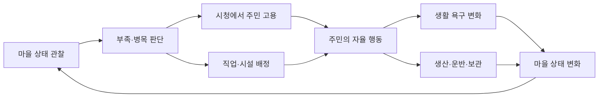
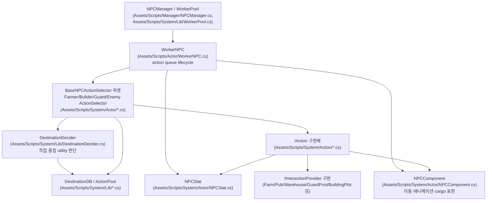
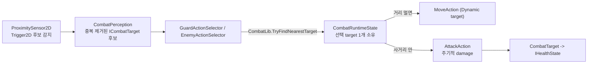
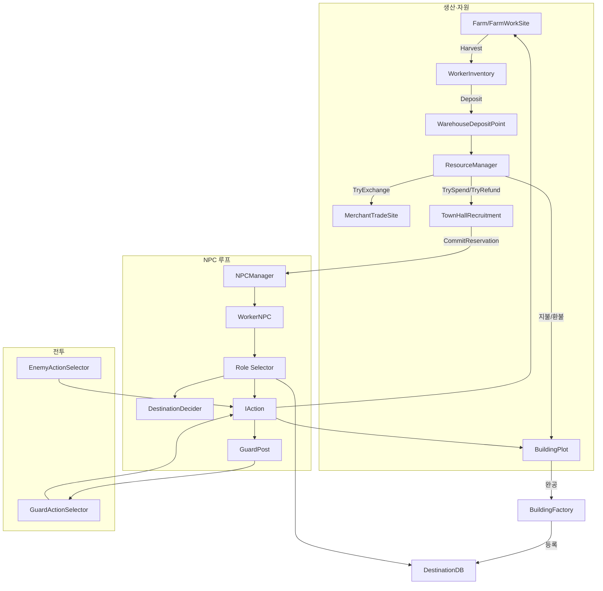

# 게임 구조 아티팩트 (2026-10-08 조사)

> 조사 기준 commit: `659dddcbf281eefa5b1d4d7dce814cb2fc20cfd8` (2026-10-06 21:34:26 +0900, `main` HEAD)
> 작성: Claude, 사용자 요청에 따른 1회성 구조 조사 문서. 구현/인수 리뷰 작업과 분리된 산출물이다.
> 방법론: `PublicMD/ProjectStructure.md`의 기능 문서 라우팅표를 따라 관련 `PublicMD/Systems/**` 문서 전체(및 Game_Plan/PLAN/SPEC 발췌)를 읽고, 각 주장을 실제 `Assets/Scripts/**`, `Assets/Data/**`, `Assets/Scenes/**`의 존재 여부·grep 결과로 대조했다. 문서 서술과 코드가 다르면 코드를 현재 사실로 적었다.

## 0. 읽기 전 주의사항 — 조사 시점의 동시 작업

이 문서를 쓰는 동안 같은 tmux 세션의 다른 pane에서 **Codex가 "승인된 주택(House) 기능"을 실시간으로 구현 중**이었다. 조사 중 `git status --short`로 다음 uncommitted 변경을 확인했다:

```text
 M PublicMD/PLAN.md
 M PublicMD/ProjectStructure.md
 M PublicMD/Systems/Construction/Definitions.md
 M PublicMD/Systems/Construction/Facilities.md
 M PublicMD/Systems/Construction/Plots.md
 M PublicMD/Systems/Construction/UI.md
 M PublicMD/Systems/README.md
 M PublicMD/Systems/UI.md
?? PublicMD/Plans/Housing_Implementation_Plan.md
?? PublicMD/Systems/Housing/
```

같은 시점에 `Assets/Scripts`에서 `House` 문자열 grep 결과는 0건이었고, `Assets/Scripts/Enum/BuildingType.cs`·`PopupType.cs`에는 House 값이 없으며, `Assets/Data/CSV/BuildingData.csv`는 여전히 Warehouse/Pub/Inn/GuardPost/Farm 5개 row뿐이었다. 즉 **주택 기능은 "설계 문서 작성/갱신 중, C# 코드·enum·CSV 데이터는 아직 미반영"** 단계다. 이 문서의 본문은 커밋 `659dddc` 기준 실제 코드를 "현재 구현"으로 서술하며, 주택은 §15에서 별도로 다룬다. 이후 Codex가 커밋을 쌓으면 이 문서의 상당 부분(특히 Construction·UI 섹션)이 곧 낡은 기록이 된다.

---

## 1. 게임 한 문장 정의와 핵심 루프

`PublicMD/Game_Plan.md`(문서 상태: 핵심 방향 초안 0.3, 2026-08-29) 기준:

> Project N은 서로 다른 능력을 가진 자율 NPC를 고용하고 직업과 시설에 배치하여, 작은 마을이 스스로 살아 움직이고 성장하게 만드는 2D 정착지 운영 게임이다.

플레이어는 개별 행동을 지시하는 지휘관이 아니라, 고용·배치·투자를 결정하는 **운영자**다(Game_Plan.md:37-39).



Phase 로드맵(Game_Plan.md §8): **Phase A(한 주민)** → **Phase B(최소 마을: 모집·직업배정·공용재고)** → **Phase C(성장·경제)** → **Phase D(전투·승패)**. `PublicMD/PLAN.md` 1절은 "현재 Phase A 진행 중"으로 명시하면서도, 실제 코드에는 건설·모집·전투·상단 거래·불만도까지 Phase B~D에 속하는 기능이 이미 상당수 구현돼 있다 — PLAN.md 자체가 "코드가 존재하는 것과 게임에서 검증 완료된 것은 구분한다"고 못박듯, **구현 범위는 Phase 표보다 앞서 있고 Play Mode 검증은 대부분 뒤처져 있다.**

---

## 2. 전체 계층 구조와 책임

`PublicMD/ProjectStructure.md` §1·§5가 명시하는 현재 구조(과거의 `WorkerAI`/`WorkerActionPlan`/`WorkerActionContext`/`WorkerActionSet`/Behavior Graph 실행기는 **존재하지 않음**):



의존 방향 불변 규칙(ProjectStructure.md §5): manager는 action 세부/role utility를 소유하지 않는다. selector는 "무엇을 할지", action은 "실행"을 소유한다. provider는 domain transaction만 실행하고 다음 행동을 선택하지 않는다.

---

## 3. 주요 진입점

| 진입점 | 경로 | 역할 |
|---|---|---|
| `NPCManager` | `Assets/Scripts/Manager/NPCManager.cs` | role별 selector·stat definition 조립, `CreateNPC`/`TryReserveWorker`/`CommitReservation`/`CancelReservation` 스폰 API |
| `DataManager` | `Assets/Scripts/Manager/DataManager.cs` | CSV 기반 item/action cost/건설 정의 조회 facade (`IDataManager`) |
| `ResourceManager` | `Assets/Scripts/Manager/ResourceManager.cs` | 마을 공용 재고(골드 포함)의 단일 scene API: `TrySpend`/`TryRefund`/`TryExchange`/`TryDeposit`/`GetQuantity` |
| `InteractableManager` | `Assets/Scripts/Manager/InteractableManager.cs` | `(GameObject, ActionType)` → `IInteractionProvider` registry |
| `BuildingFactory` | `Assets/Scripts/Manager/BuildingFactory.cs` | 완공 시설 조립·주입·등록, 실패 정리 |
| `BuildingPlotRegistry` | `Assets/Scripts/Manager/BuildingPlotRegistry.cs` | 건설 가능 부지 후보와 FIFO 신청 순번 |
| `LocalizeManager` | `Assets/Scripts/Manager/LocalizeManager.cs` | CSV 문구 조회, persistent singleton |
| `UIManager` | `Assets/Scripts/UI/UIManager.cs` | popup/hover category registry (UI facade) |

씬 레벨 진입점(테스트 씬이 곧 현재의 "게임 씬"이다 — 정식 메인 씬/부트스트랩 없음, §12 참고): `Assets/Scenes/FarmerTest.unity`, `BuildingTest.unity`, `GuardTest.unity`, `LocalizeTest.unity`, `TileMapTest.unity`, `Assets/TestOnly/HarnessTest.unity`.

---

## 4. 주민·직업·행동

### 4.1 직업(NPCType)과 selector 구현 현황

`Assets/Scripts/Enum/NPCType.cs`:

```csharp
public enum NPCType { Farmer, Guard, Cook, Enemy, Builder }
```

| NPCType | selector 구현 | 비고 |
|---|---|---|
| Farmer | `Assets/Scripts/System/Actor/FarmerActionSelector.cs` | 농사·수확·운반·입고, Phase A 핵심 역할 |
| Guard | `Assets/Scripts/System/Actor/GuardActionSelector.cs` | 전투·순찰, Phase D 조기 구현 |
| Builder | `Assets/Scripts/System/Actor/BuilderActionSelector.cs` | 건설 FIFO 예약·작업, Phase B 조기 구현 |
| Enemy | `Assets/Scripts/System/Actor/EnemyActionSelector.cs` | 전투 전용, NPCType 소속이지만 생활 욕구 없음 |
| **Cook** | **없음** | Game_Plan.md가 Phase B 도입으로 계획한 "요리사" 직업. enum 값만 예약돼 있고 `CookActionSelector` 류는 `Assets/Scripts/System/Actor`에 존재하지 않는다 — **완전 미구현** |

Town Hall의 모집 대상은 Farmer/Guard/Builder 세 직군뿐이다(`Town_Hall.md`) — Cook은 모집 UI에도 없다.

### 4.2 판단 → 이동 → 실행 → 상태변화 1사이클

```text
WorkerNPC.Init(role, stat, selector)
  -> selector.RequestNewActionQueue(...)
     -> DestinationDecider.Decide(stat, role, position, cost)   // 직업 중립 utility+위험+bounded look-ahead(최대 3)
     -> ActionPool에서 IAction 대여, ActionContext 주입
  -> WorkerNPC가 큐를 순서대로 Tick
     -> Completed: 다음 action
     -> ReplanRequested/Failed: 남은 큐 전부 반환 후 selector에 재요청
```

(`Assets/Scripts/Actor/WorkerNPC.cs`, `Assets/Scripts/System/Lib/DestinationDecider.cs`, `Assets/Scripts/System/Actor/BaseNPCActionSelector.cs`)

Farmer의 실제 우선순위(`FarmerActionSelector.cs`, `NPC_Decision_and_Actions/Selector_and_Queue.md`): 태업이면 생활/배회 → 아니면 **긴급 욕구 > Harvest(봇짐 여유 있을 때) > Deposit(봇짐 있을 때) > DestinationDecider 결과(Work/Eat/Drink/Sleep/Idle)**.

### 4.3 ActionType과 IAction 구현 현황

`Assets/Scripts/Enum/ActionType.cs`: `Move, Sleep, Eat, Drink, Farming, Idle, Guard, Attack, Harvest, Deposit, Wander, Build` (12종, 전부 구현됨 — `NotImplementedException` 스텁은 현재 없다).

| ActionType | 구현 파일 | 책임 |
|---|---|---|
| Move | `MoveAction.cs` | Direct/Navigation 이동, stopping distance, 경로 실패 1초 대기 후 재판단 |
| Eat / Drink | `EatAction.cs` / `DrinkAction.cs` | provider transaction 1회 + StatEffect 적용 |
| Sleep | `SleepAction.cs` | 실내 대기 후 fatigue 회복 (provider transaction 없음) |
| Idle | `IdleAction.cs` | queue 비거나 fallback일 때 짧은 안전 대기 |
| Wander | `WanderAction.cs` | 공통 배회(최대 5초 이동+1초 휴식), 생활/태업 queue에서 사용 |
| Farming / Harvest | `FarmingAction.cs` / `HarvestAction.cs` | FarmWorkSite interaction 1회(3초), 동일 `FarmingActionCost` 비용 |
| Deposit | `DepositAction.cs` | WorkerInventory → WarehouseDepositPoint 입고 |
| Build | `BuildAction.cs` | BuildingPlot 이동+작업+lease 정리 |
| Guard | `GuardAction.cs` | GuardPost 영역 내 장기 순찰, 고정 duration 없이 감지/need로 재판단 |
| Attack | `AttackAction.cs` | 공통 공격 interval+damage, Guard/Enemy 공용 |

기반 클래스: `DefaultAction.cs`(lifecycle 공통), `BaseWorkingAction.cs`(작업 모션+provider 재확인), `BaseBuildingAction.cs`(실내 action 출입 표현).

### 4.4 불만도·태업

`PublicMD/Systems/NPC_Dissatisfaction.md` 기준, Farmer·Builder·Guard에 적용(Enemy 제외). 현재 원인은 **`Homeless` 단 하나**(`Assets/Scripts/Enum/DissatisfactionCause.cs`: `None=0, Homeless=1`)이며 **자동으로 등록되는 경로는 없다** — 주택이 생기면 무주택을 첫 자동 원인으로 연결할 계획(Game_Plan.md:180)이지만 아직 수동 API(`TrySetCauseActive`)만 존재한다.

```text
NPCDissatisfaction(Actor/NPCDissatisfaction.cs) — 시간 갱신(초당 1 증가/1 감소, 상한 100, 태업 기준 60)
  -> DissatisfactionState(System/Actor/DissatisfactionState.cs) — 원인별 누적·회복·제한 합산
  -> IStatView.IsOnStrike
     -> selector가 업무 provider 조회 전 확인
        -> 태업이면 공통 생활/배회 queue(BaseNPCActionSelector.BuildLeisureQueue)로 전환
        -> 실행 중인 업무 action(RequiresWorkAvailability=true)은 효과 적용 전 ReplanRequested
```

---

## 5. 생산·자원·인벤토리

### 5.1 농사(Farming)

```text
빈 밭 클릭 -> SeedSelectionPopup -> FarmSeedSource.TryPlantSeed(seedItemId)
  -> CropCatalog 검증 + ResourceManager.TrySpend(씨앗 1개)
  -> FarmWorkSite: current crop 설정, Growing, progress 0
Farmer selector -> FarmWorkSite.TryGetActionPosition (batch당 1회, 4x2 셀 shuffle)
  -> MoveAction + FarmingAction(batch, Growing) 또는 HarvestAction(1회, Harvesting)
  -> FarmWorkSite.TryInteract -> progress 증가 또는 pending yield를 cargo로 인도
  -> StateChanged -> FarmCropPresenter(성장 단계 sprite cascade, 수확 소멸)
  -> 봇짐 가득 -> selector가 Warehouse Deposit queue로 전환
```

(`Assets/Scripts/System/Farming/FarmWorkSite.cs`, `Assets/Scripts/Actor/FarmSeedSource.cs`, `Assets/Data/ScriptableObject/Script/FarmProductionDefinition.cs`, `CropCatalog.cs`)

현재 crop은 **Carrot / Potato 2종**, 각 4단계 성장(0/0.333/0.667/1), SeedItemId 6/7 → OutputItemId 4/5(`Definition_and_Catalog.md`). 작업 위치 난수와 수확량 난수는 별도 `SeededRandomSource`로 분리.

### 5.2 공유 자원·인벤토리

```text
ResourceManager(scene 공개 API) -> ResourceInventory(수량·용량 실제 보관)
  TryDeposit(부분 입고) / TrySpend(전량 지출) / TryRefund(용량초과 허용 전량 환급) / TryExchange(원자적 교환)
WorkerInventory(NPC 1개 품목 cargo) -> InteractionRequest.Cargo -> WarehouseDepositPoint -> ResourceManager
```

`ItemData.csv`(`Assets/Data/CSV/ItemData.csv`)는 12열(기존 10열+`usesStorage,showInWarehouse`), ID 1–7 품목 + **Gold=8**(용량 미사용, 창고 비표시) + **Wood=9, Stone=10**(건설 자재, `Item_Data.md`). 창고 제공 용량은 완공 창고(`BuildingData.csv` row 1, `providedCapacity=500`)의 합산이며 기본 용량은 0.

골드는 별도 저장소가 아니라 `ResourceManager`의 item ID 8일 뿐이다(`Player_Gold.md`) — 상단 판매(`MerchantTradeSite.TryTrade`)와 시청 모집 지출(`TownHallRecruitment`)·건설 지불(`BuildingPlot`)이 모두 같은 `ResourceManager` API를 공유한다.

---

## 6. 건설(Construction)과 건축가(Builder)

```text
DataManager 정의 조회 -> 클릭한 BuildingPlot(Assets/Scripts/Actor/BuildingPlot.cs)의 지불/공사 생성
  -> BuilderActionSelector가 BuildingPlotRegistry에서 FIFO로 가용 공사 탐색·이동 전 예약
  -> BuildAction(이동+도착 후 CSV 작업속도x시간)
  -> BuildingPlot의 완공 요청 -> BuildingFactory 조립·주입·DestinationDB/InteractableManager 등록
```

현재 CSV 정의 건물 5종(`BuildingData.csv`): **Warehouse(용량500) · Pub(식당) · Inn(숙소) · GuardPost(초소) · Farm(농경지)**, 모두 `requiredWork=100, maxWorkers=2`. `BuildingTest.unity`에 부지 6개가 3×2로 배치되어 있고(`Construction/Plots.md`), `ConstructionVisual.cs`가 진행률 0/25/50/75%에 맞춰 자재→골조→가림막 단계를 DOTween으로 표시한다.

Builder 전용 생활/건설 queue는 `BuilderActionSelector.cs`가 소유하며, 공사가 없으면 `TilemapNavigation.TryGetRandomReachablePosition`으로 배회 위치를 구해 `WanderAction` 하나를 대여한다(`Builder.md`). 수리·철거는 범위 밖.

**확인**: `BuildingPlot.cs`(224줄)에 `grep -n "Upgrade"`를 직접 실행한 결과 0건이다. 즉 "주택 업그레이드"(`TryStartUpgrade`/`IsUpgrade` 등) 관련 서술은 현재 Codex가 작성 중인 미커밋 `Construction/Plots.md` diff에만 존재하는 **설계 문서상의 계획**이며, `BuildingPlot.cs` 코드에는 아직 반영되지 않았다 — §15에서 다시 언급한다.

---

## 7. 모집(Town Hall)과 상단(Merchant Caravan)

### 7.1 시청 모집

하나의 `TownHallRecruitment`(`Assets/Scripts/Actor/TownHallRecruitment.cs`)가 Farmer(60초/100골드)·Guard(90초/100골드)·Builder(60초/100골드) 세 직군을 독립 쿨다운으로 관리한다.

```text
TryDispatchCandidate(NPCType) -> NPCManager.TryReserveWorker -> ResourceManager.TrySpend
  -> 성공 직군만 Recruiting 전환 -> 전체 쿨다운 재설정
  -> SpawnLanding 연출(NPCGirl 6유닛 낙하 clip) -> CommitReservation
  -> 실패/teardown 시 예약 취소 + 지원금 환급(PendingRefund 재시도 지원)
```

### 7.2 상단 거래

상단(캐러밴)은 **WorkerNPC/IAction/selector를 전혀 거치지 않는 방문 연출 세트**다(`Merchant_Caravan.md`). `MerchantArrivalScheduler`가 방문 간격을 재고, `MerchantCaravan.VisitRoutine()` 코루틴이 등장→체류→퇴장을 담당한다. 체류 중에만 `MerchantVisual.SetTradeAvailable(true)`로 클릭이 열리고 `MerchantPopup`에서 창고 품목을 드래그해 판매한다. 거래는 `MerchantTradeSite.TryTrade`가 `CropCatalog` 기준 재검증 후 `ResourceManager.TryExchange`로 원자적으로 처리한다. **구매(Buy) 기능은 없음** — 판매 전용.

**씬 배선 관련 주의**: `FarmerTest.unity` YAML 문자열 grep에서 `MerchantCaravan`은 확인되지만 `MerchantTradeSite`/`MerchantPopup`/`PointerClickRouter`는 매칭되지 않았다. 이는 두 가지로 해석 가능하다 — (a) 아직 씬에 실제로 배선되지 않았거나, (b) popup류가 `UIManager`의 prefab registry를 통해 간접 참조되어 스크립트 클래스명이 씬 YAML에 직접 노출되지 않는 구조일 수 있다. 이 조사는 코드 존재와 enum 일치는 직접 확인했지만 씬 YAML의 모든 프리팹 참조 체인을 역추적하지는 않았으므로, **상단 거래 UI의 실제 클릭 가능 여부는 "미배선 확정"이 아니라 "Play Mode 확인 필요" 항목으로 본다.**

---

## 8. 전투(Combat)



Guard는 target 없으면 `DestinationDecider`로 공급(Eat/Drink/Sleep)과 **Guard duty**(GuardPost 영역 내 장기 순찰, 고정 duration 없이 재판단)를 선택한다. Enemy는 need/destination을 전혀 쓰지 않고 감지된 target에만 반응하며, 없으면 Idle(강제 랜덤 이동 없음). **Enemy production spawn 경로는 없고** `Assets/TestOnly/TestEnemyRainSpawner.cs`가 유일한 생성 수단이다(`Combat/Enemy.md`) — 즉 전투는 "방어 루프의 뼈대는 있지만 실제 적이 자연 발생하지 않는" 상태다.

---

## 9. UI·지역화·카메라

- **입력 경로 2종**: world 클릭/hover는 `PointerClickRouter`/`PointerHoverRouter`(Physics2D.OverlapPoint)가 `IClickPopupSource`/`IHoverInfoSource`를 거쳐 `UIManager`로 연결한다. 드래그앤드롭(상단 판매 UI)은 uGUI `EventSystem` 기반의 완전히 별개 계통이다(`UI.md`).
- **현재 concrete popup 5종**(코드 기준, House 제외): `MerchantPopup, TownHallPopup, SeedSelectionPopup, ConstructionPopup, WarehousePopup` — 모두 `Assets/Scripts/UI/`에 실존.
- **상시 HUD**: `GoldHUD.cs`가 `ResourcesChanged` 이벤트로 골드 잔액/증감을 표시(popup/hover registry 미등록, 항상 켜짐).
- **지역화**: `LocalizeData.csv → LocalizeKeyGenerator → LocalizeKey.cs(생성 Enum) → LocalizeManager(ko 고정) → LocalizeText`. 현재 **한국어(ko)만 지원**, TMP 기본 폰트에는 한글 glyph가 없어 "데이터 조회 성공"과 "화면 표시 성공"이 다르다(Localization.md §제약).
- **카메라**: `Assets/TestOnly/TestCameraArrowMove.cs` — 방향키 이동 + 마우스 휠 직교 줌뿐인 **임시 테스트 컴포넌트**. 정식 카메라 시스템 없음.

---

## 10. 데이터 구성

| 파일/종류 | 경로 | 현재 row/항목 수 |
|---|---|---|
| 아이템 | `Assets/Data/CSV/ItemData.csv` | ID 1–10 (1–7 기존 품목, 8 Gold, 9 Wood, 10 Stone) |
| 건물 정의 | `Assets/Data/CSV/BuildingData.csv` | 5 row (Warehouse/Pub/Inn/GuardPost/Farm) |
| crop 생산 정의 | `FarmProductionDefinition_Carrot.asset`, `_Potato.asset` | 2종 |
| 작물 catalog | `CropCatalog.asset` | Carrot/Potato 등록 |
| 판단 tuning | `NPCDecisionTuning.asset` | 위험·시간·보상·look-ahead(최대 3) |
| 지역화 | `Assets/Data/CSV/LocalizeData.csv` | ko 1개 언어 |

CSV→정의 변환 공통 경로: `CSVParser → *CsvMapper → *Context(SO) → IDataManager/DataManager → consumer` (Game_Plan.md §7.2와 일치).

---

## 11. 씬 구성

| 씬 | 역할 | 확인된 주요 배선(그룹 GameObject 존재 확인) |
|---|---|---|
| `FarmerTest.unity` | Farmer/Guard/Builder 통합 수직 슬라이스, 모집·상단·불만도 검증 중심 | NPCManager, DestinationDB, WorkerPool, UIManager, ResourceManager, GuardPost 각 1 |
| `BuildingTest.unity` | 건설 시스템 전용 검증 씬, 부지 6개 | 위 전부 + BuildingPlotRegistry, BuildingFactory, BuildingPlot류 오브젝트 7 |
| `GuardTest.unity` | Guard/Enemy 전투 상호 감지 검증 | NPCManager, DestinationDB, WorkerPool, UIManager, ResourceManager, GuardPost 각 1 |
| `LocalizeTest.unity` | 지역화 단독 검증 | LocalizeManager 등 |
| `TileMapTest.unity` | 타일맵/내비게이션 원형 검증 | — |
| `Assets/TestOnly/HarnessTest.unity` | Codex/Claude 작업 하네스 전용 | production 비의존 |

**정식 "메인 게임 씬"은 존재하지 않는다** — 5개 기능 검증용 테스트 씬이 현재 게임의 실체이며, 각 씬이 서로 다른 기능 조합(FarmerTest=생활+경제+모집, BuildingTest=건설, GuardTest=전투)을 담당한다. `Assets/_Recovery`는 Unity 복구 산출물로 runtime 구조와 무관하다(ProjectStructure.md §4).

---

## 12. 전체 관계도 (요약)



---

## 13. 현재 미구현·스텁·TBD 종합

| 영역 | 상태 | 근거 |
|---|---|---|
| **House(주택)** | 문서 설계 중, 코드/CSV 완전 미반영 | §0, §15 |
| **Cook(요리사) 직업** | enum만 존재, selector/action 없음 | `NPCType.cs`, §4.1 |
| 조리(원재료→음식) | 미구현 — Pub는 고정 item table로 Eat/Drink option만 제공 | `Interaction_and_Destinations.md` |
| 네임드 주민, 후보 갱신 주기 | `TBD` (Game_Plan.md §5.6) | — |
| 전직·스탯 성장의 관찰 가능한 성과 | `TBD`(GD-005) | Game_Plan.md §11 |
| Enemy 자연 발생 spawn | 없음, TestOnly spawner만 | `Combat/Enemy.md` |
| NPC 사망/부상/치료 | 미구현. GuardPost 사망 시 임시 GameOver 로그만 | `Combat/Guard.md` |
| despawn/해고 | production API 없음 | `NPC_Runtime.md` TBD |
| 다품목 봇짐(한 NPC가 여러 종류 운반) | 구조상 미지원, 단일 품목만 | `Cargo_and_Deposit.md` |
| 상단 구매(Buy) | 없음, 판매만 가능 | `Merchant_Caravan.md` |
| 저장/불러오기 | `TBD`(GD-010), 범위 밖 | Game_Plan.md §11 |
| 지역화 다국어 | ko 고정, 언어 선택 UI 없음 | `Localization.md` |
| 정식 카메라 시스템 | 없음, 테스트 전용 컴포넌트만 | `Camera_Control.md` |
| `NPCPrefabCatalog` 다중 pool 통합 | 미통합, `WorkerPool`은 단일 prefab만 소유 | `Spawning_and_Pooling.md` |
| 수리·철거(건설) | 범위 밖 | `Construction/Plots.md` |
| 실제 Play Mode 전체 회귀 | 대부분 `NOT_VERIFIED`/사람 확인 대기 (각 Systems 문서의 "알려진 제약과 TBD" 참고) | 전 영역 공통 |

---

## 14. 그 외 확인된 설계 세부사항 (문서 중복/정리 이슈)

`PublicMD/Systems/Inventory_and_Items.md`(3줄)는 이미 `Inventory_and_Items/README.md`로의 리다이렉트 스텁이다 — 실제 내용 중복은 없고 ProjectStructure.md 라우팅표가 지목하는 폴더형 인덱스가 현재 유효 문서다. 이 문서 자체도 §8 문서 갱신 규칙에 따라 조만간 교정 대상일 수 있다.

`Assets/Scripts/Enum/BuildingType.cs`에는 `None, Pub, Well, Inn, Farm, GuardPost, Warehouse` 7개 값이 있는데, `BuildingData.csv`에는 `Well`에 대응하는 row가 없다(Warehouse/Pub/Inn/GuardPost/Farm 5종만). `Well`은 enum에만 남아있는 미사용/레거시 값으로 보이며, 코드에서 실제 참조처가 있는지는 이번 조사에서 별도로 추적하지 않았다.

---

## 15. 주택(House) 기능 — 조사 시점 상태 (중요)

이 조사의 가장 중요한 경계 조건이다. **단정적으로 서술하지 않는다.**

- **커밋된 사실**: `659dddc` 커밋("Add house tier sprites and update project structure")은 `Assets/Art/Generated/Buildings/House/house-tiers.png` 스프라이트 시트 1개를 추가했을 뿐이다.
- **조사 시점(uncommitted) 사실**: Codex가 `PublicMD/Plans/Housing_Implementation_Plan.md`(신규, 36줄)와 `PublicMD/Systems/Housing/`(신규 폴더: `README.md`, `UI.md`)을 작성했고, `ProjectStructure.md`/`PLAN.md`/`Systems/README.md`/`Construction/*.md`/`UI.md`에 주택을 연결하는 소규모 편집(도합 8개 파일, +20/-4줄)을 가했다.
- **같은 시점 코드 사실**: `Assets/Scripts` 전체에 `House` 문자열이 0건, `BuildingType.cs`에 `House` 값 없음, `PopupType.cs`에 `House` 값 없음, `BuildingData.csv`에 House row 없음.

결론: 이 조사 시점 기준으로 주택은 **"설계 문서만 갱신됨, 게임플레이 코드·데이터·enum은 전혀 반영되지 않음"**이다. 이 문서의 §6(건설)·§9(UI)·§13(미구현 목록)에 적은 House 관련 서술은 모두 이 경계를 기준으로 한다. 이후 Codex의 작업이 커밋되면 `BuildingType.House`, `PopupType.House`, `HousePopup`, `HousingManager`, `HousingDataContext` 등이 실제로 생길 가능성이 높으므로, 이 문서를 다시 참고할 때는 반드시 최신 commit과 `git status`를 재확인해야 한다.

---

## 16. 조사 방법과 한계

- 모든 서술은 `PublicMD/ProjectStructure.md` 라우팅표 → 지목된 `PublicMD/Systems/**` 전체 leaf → 실제 코드/씬 YAML grep의 3단계로 대조했다.
- 조사는 4개 영역으로 나눠 독립적으로 수행했다: (1) NPC 생성·판단·행동·상태변화 핵심 루프, (2) 생산·자원·인벤토리, (3) 건설·시청(모집)·상단(무역), (4) 전투·UI·지역화·카메라. 네 조사가 겹치는 지점(예: `PopupType` 5종, `ActionType` 12종, `Cook` 직업 미구현, Enemy 자연 발생 spawn 없음, `WorkerPool` 단일 prefab, House는 스프라이트만 존재)에서 서로 독립적으로 동일한 결론에 도달해 교차 검증됐다.
- 코드 대조는 파일 존재 확인(`find`/`ls`), 핵심 enum·CSV 내용 직접 Read, 씬 YAML의 GameObject 이름 grep으로 수행했다. `PopupType.cs`, `ActionType.cs`, `BuildingType.cs`, `NPCType.cs`, `BuildingData.csv`, `BuildingPlot.cs`(`Upgrade` 키워드 grep)는 이 문서를 마무리하며 직접 다시 열어 재확인했다. 그 외 모든 `.cs` 파일의 전체 구현 로직을 라인 단위로 읽지는 않았으므로, 문서가 서술하는 세부 알고리즘(예: utility 공식 상수, 애니메이션 타이밍)은 `PublicMD/Systems/**`의 1차 서술을 신뢰했다 — 단, 그 문서들이 "실제 코드를 따른다"는 ProjectStructure.md 원칙 자체를 전제로 했다.
- Unity 실행·Play Mode 검증·씬 저장은 사용자 지시에 따라 수행하지 않았다. 각 섹션의 "검증 상태"는 해당 `PublicMD/Systems/**` 문서와 `PublicMD/Status/PROGRESS.md`가 자체적으로 표시한 값을 그대로 인용했다.
- `PublicMD/Status/PROGRESS.md` 꼬리 부분(IMP-022~028)은 `WorkerAIManager`/`WorkerActionSet`/`SampleScene` 등 현재 코드베이스에 없는 과거 구조를 언급하는 낡은 기록이라 이 문서의 근거로 사용하지 않았다.
