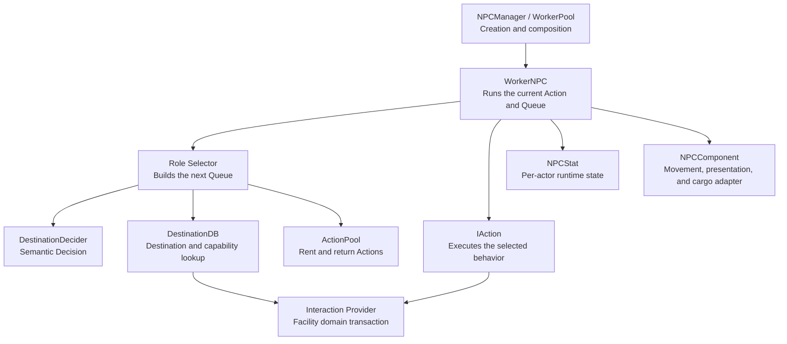
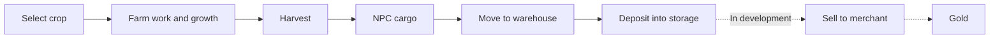

# Project N

> **Work in Progress** · A Unity 2D settlement management game built around autonomous NPCs

**English** | [한국어](README.md)

Project N is a solo portfolio project about managing a small settlement whose residents make decisions and perform their assigned work autonomously.

The player does not issue every movement or task directly. Instead, they decide whom to recruit, where each resident should work, what the settlement should produce, and how to address shortages in resources and facilities.

<!--
## Gameplay Preview

Add the main gameplay GIF or video here when it is ready.
Planned path: docs/media/project-n-gameplay.gif
-->

## Overview

| Item | Details |
|---|---|
| Genre | 2D settlement management and autonomous NPC simulation |
| Development | Solo portfolio project |
| Engine | Unity 6000.3.9f1 |
| Core technologies | C#, Utility AI, action queues, object pooling, ScriptableObjects, CSV |
| Current milestone | Phase A in progress — completing one NPC's autonomous behavior loop |
| Main scene | `Assets/Scenes/FarmerTest.unity` |

## Core Experience

- NPCs evaluate their own state and available facilities to choose their next action.
- The player sets roles and production goals, then observes the causes and results of NPC behavior.
- Products do not teleport into global storage; they move through `farm → NPC cargo → warehouse`.
- Needs, production, and logistics affect one another and create visible operational bottlenecks.
- The long-term goal is to connect recruitment, progression, trade, and defense into one compact settlement loop.

## Key Features

### Autonomous NPC Decision-Making

`DestinationDecider` compares NPC state, travel time, action cost, risk, and predicted outcomes in one utility model. It uses bounded look-ahead of up to three levels and returns a semantic decision instead of an executable object.

- Work, food, drink, sleep, and idle candidates share one decision boundary
- Hard safety filtering is kept separate from utility penalties
- Seeded randomness produces repeatable results for identical inputs
- Role selectors add job-specific priorities without duplicating the shared utility calculation

### Separation of Decision, Execution, and State



- `WorkerNPC` owns only the action queue lifecycle
- Selectors choose the next behavior and execution sequence
- Actions own start, execution, completion, failure, and replanning behavior
- Providers perform facility transactions for farms, warehouses, and other destinations
- `NPCComponent` adapts movement, direction, animation, tools, and cargo presentation
- `NPCStat` stores mutable state independently for each NPC

### Action Lifecycle and Pooling

Every action follows the same lifecycle and can be reused.

```text
Init → Start → Tick* → Completed | ReplanRequested | Failed
                    ↘ cancellation → Stop
Return → Clear → Pool
```

- Normal environment changes and configuration failures use different results
- A partially built queue returns every rented action if any step fails
- Returning an action clears its context, timers, target, and presentation state
- Disabling or reusing an NPC does not preserve behavior or cargo from its previous run

### Farming, Harvesting, and Logistics Vertical Slice



- Carrot and Potato production values, work requirements, and output items are defined with ScriptableObjects
- Crop output IDs are cross-validated against the CSV item table
- Growth phase, harvest phase, and progress are stored per farm instance
- NPCs keep one work position per batch, selected from a shuffled 4×2 farm grid
- Harvest yield and work-position randomness use separate streams
- NPC cargo supports one item type and limited capacity while preserving quantities rejected by a destination
- Partial acceptance removes only the transferred quantity and never rerolls the remaining harvest

### Combat Prototype

- Guards prioritize detected combat targets over supply and patrol behavior.
- Enemies use Idle, Move, and Attack without depending on settlement needs or facilities.
- Perception owns candidate detection, while each actor's `CombatRuntimeState` owns its selected target.
- Dynamic target movement, melee and ranged approach distances, attack intervals, and damage share common action boundaries.

### Separation of Data and Unity Presentation

- CSV: table-oriented static data such as items
- ScriptableObjects: shared crop, stat, action-cost, and decision-tuning definitions
- Plain C# objects: per-NPC stats, selected-target state, and cargo state
- Scene components: per-placement farm progress, warehouse quantities, and facility availability
- Presentation components: animation and sprite updates that cannot mutate gameplay transactions

## Current Development Status

> Existing code and completed Unity Play Mode verification are tracked separately.

| Area | Status | Notes |
|---|---|---|
| NPC action queue and lifecycle | Implemented | Completion, failure, cancellation, replanning, and pool-return paths |
| Utility-based destination and action selection | Implemented | Up to three-level look-ahead with seeded determinism |
| Facility interaction protocol | Implemented | Destination/provider registries and request/result contracts |
| Crop selection and basic production | Partially verified | Basic Carrot/Potato flow confirmed in Play Mode |
| Harvesting, cargo, and warehouse deposit | Verification in progress | Code and scene wiring exist; full Play Mode regression testing remains |
| Crop growth presentation | Verification in progress | Stage and cascade animation implemented; final scene verification remains |
| Guard and Enemy combat | Prototype | Test scene exists; production spawning and final targeting policies are incomplete |
| Gold and merchant selling | In development | Foundation and wiring exist; trade UI and transaction fixes remain |
| Recruitment, job assignment, progression, and raids | Planned | Scheduled for later phases |

The current C# project compiles with **0 warnings and 0 errors** using `dotnet build Assembly-CSharp.csproj --no-restore`. This does not imply feature completion; runtime work is verified separately in Unity Play Mode.

## Technology Stack

- Unity `6000.3.9f1`
- C#
- Universal Render Pipeline 2D `17.3.0`
- Unity Input System `1.18.0`
- Unity UI (UGUI) `2.0.0`
- ScriptableObject and CSV-based static data
- Unity Object Pooling
- Animator Controllers and 2D sprite animation

## Project Structure

```text
Assets/
├─ Scripts/
│  ├─ Actor/       Scene actors and facility components
│  ├─ Manager/     Scene composition and registry entry points
│  ├─ System/      Actions, selectors, runtime state, and domain logic
│  ├─ Interface/   Minimal contracts shared across features
│  └─ UI/          Popups, hover views, and pointer routing
├─ Data/
│  ├─ Struct/      Requests, results, and immutable values
│  ├─ CSV/         Table-oriented static data
│  └─ ScriptableObject/
├─ Prefab/         NPC, facility, crop, and UI prefabs
├─ Scenes/         Feature validation scenes
└─ TestOnly/       Manual verification tools not referenced by production code

PublicMD/
├─ Systems/        Current feature architecture and ownership
├─ Plans/          Active implementation plans
├─ Status/         Development progress and code-review results
└─ Archive/        Completed or superseded plans
```

## Running the Project

1. Clone the repository.
2. Open the project in Unity Hub with Unity `6000.3.9f1`.
3. Open `Assets/Scenes/FarmerTest.unity`.
4. Enter Play Mode to inspect the current farming and NPC flow.

The combat prototype can be inspected in `Assets/Scenes/GuardTest.unity`. A standalone release build is not currently provided.

## Development Roadmap

| Phase | Goal |
|---|---|
| A — One Living Resident | Complete one NPC's decision, movement, work, and needs loop |
| B — A Minimal Village | Connect recruitment, job assignment, production, processing, and consumption |
| C — Growth and Economy | Connect stats, experience, trade, gold, and recruitment candidates |
| D — Crisis and Conclusion | Deliver defense, recovery, victory, and defeat in a portfolio-ready build |

Current priorities and completion criteria are tracked in the [Phase Plan](PublicMD/PLAN.md).

## Documentation

- [Game Plan](PublicMD/Game_Plan.md) — vision, core experience, and product scope
- [Architecture](PublicMD/ARCHITECTURE.md) — shared design principles and dependency direction
- [Project Structure](PublicMD/ProjectStructure.md) — folder ownership and documentation map
- [Systems](PublicMD/Systems/README.md) — current implementation by feature
- [Progress](PublicMD/Status/PROGRESS.md) — implementation, verification, and remaining work

## Development Process and AI Assistance

Project N is a solo project that uses AI tools for planning support, implementation assistance, code review, and selected visual asset generation. Final requirements, architecture decisions, Unity integration, testing, and project management remain the developer's responsibility.
