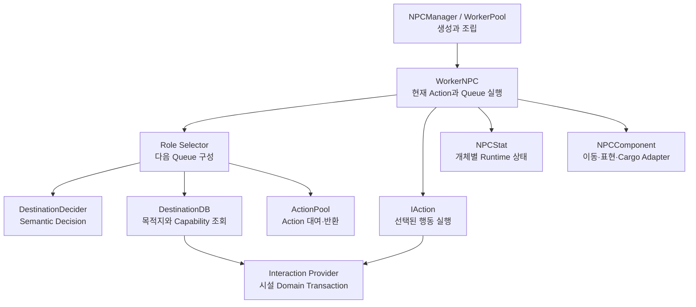

# Project N

> **Work in Progress** · Unity 2D 자율 NPC 정착지 운영 게임

[English](README.en.md) | **한국어**

Project N은 서로 다른 상태와 역할을 가진 NPC를 배치하고, 주민들이 스스로 판단하고 일하는 작은 마을을 운영하는 1인 개발 포트폴리오 프로젝트입니다.

플레이어는 주민의 행동을 매 순간 직접 명령하지 않습니다. 어떤 주민을 고용하고 어디에 배치할지, 어떤 작물을 생산할지, 부족한 자원과 시설을 어떻게 보완할지를 결정하고 그 결과를 관찰합니다.

<!--
## 플레이 영상

대표 gameplay GIF 또는 영상을 준비한 뒤 이 위치에 추가합니다.
예정 경로: docs/media/project-n-gameplay.gif
-->

## 프로젝트 개요

| 항목 | 내용 |
|---|---|
| 장르 | 2D 정착지 운영·자율 NPC 시뮬레이션 |
| 개발 형태 | 1인 개발, 포트폴리오 프로젝트 |
| 엔진 | Unity 6000.3.9f1 |
| 핵심 기술 | C#, Utility AI, Action Queue, Object Pooling, ScriptableObject, CSV |
| 현재 단계 | Phase A 진행 중 — 한 NPC의 완결된 자율 행동 루프 구축 |
| 대표 실행 씬 | `Assets/Scenes/FarmerTest.unity` |

## 핵심 경험

- NPC는 자신의 상태와 이용 가능한 시설을 평가해 다음 행동을 스스로 선택합니다.
- 플레이어는 주민의 직업과 생산 방향을 정하고, 행동의 원인과 결과를 관찰합니다.
- 생산물은 즉시 전역 재고로 이동하지 않고 `농장 → NPC 봇짐 → 창고`를 거칩니다.
- 주민의 욕구, 생산과 물류가 서로 영향을 주어 운영상의 병목을 만듭니다.
- 장기적으로 모집, 성장, 거래와 방어를 하나의 작은 마을 운영 루프로 연결하는 것을 목표로 합니다.

## 주요 구현 특징

### 자율 NPC 판단

`DestinationDecider`가 NPC 상태, 이동 시간, 행동 비용, 위험도와 예상 결과를 같은 utility 모델에서 비교합니다. 최대 3단계의 bounded look-ahead를 사용하며, 결과는 실행 객체가 아닌 하나의 semantic decision으로 반환됩니다.

- 업무, 식사, 음료, 수면과 대기를 동일한 판단 경계에서 비교
- 위험한 후보의 hard filtering과 utility penalty 분리
- 같은 seed와 입력에서 같은 결과를 만드는 결정적 난수
- role selector는 공통 utility 계산을 복제하지 않고 직업별 우선순위만 추가

### 판단·실행·상태의 책임 분리



- `WorkerNPC`: action queue lifecycle만 소유
- selector: 다음 행동과 실행 순서를 결정
- action: 선택된 행동의 시작, 실행, 완료, 실패와 재판단 처리
- provider: 농장, 창고 등 시설의 실제 transaction 수행
- `NPCComponent`: 이동, 방향, animation, 도구와 화물 표현 담당
- `NPCStat`: NPC마다 독립된 mutable 상태 보관

### Action lifecycle과 pooling

모든 action은 다음 lifecycle을 따르며 재사용됩니다.

```text
Init → Start → Tick* → Completed | ReplanRequested | Failed
                    ↘ cancellation → Stop
Return → Clear → Pool
```

- 정상적인 환경 변화와 구성 오류를 서로 다른 결과로 표현
- queue 구성 중 하나라도 실패하면 대여한 action을 전부 반환
- pool 반환 시 context, timer, target과 presentation 상태 초기화
- NPC가 비활성화되거나 재사용될 때 이전 행동과 화물이 남지 않도록 정리

### 농사·수확·물류 Vertical Slice


- Carrot과 Potato의 생산량, 작업 요구치와 결과 item을 ScriptableObject로 정의
- crop ID와 output item ID를 CSV item table과 교차 검증
- 성장 단계와 수확 상태를 농장 배치별 runtime 상태로 관리
- 한 작업 batch 동안 같은 위치를 사용하고 4×2 작업 셀을 섞어 NPC 작업 위치 분산
- 수확량 난수와 위치 난수를 별도 stream으로 분리
- NPC 봇짐은 단일 item type과 제한 용량을 가지며 창고가 거부한 수량을 보존
- 부분 수락 시 실제 이동한 수량만 차감하고, 남은 생산량을 다시 굴리지 않음

### 전투 Prototype

- Guard는 감지된 전투 대상을 공급과 순찰보다 우선합니다.
- Enemy는 생활 욕구나 시설 판단 없이 감지된 대상에 대해 Idle, Move, Attack을 구성합니다.
- perception은 후보만 관리하고, 선택된 target은 NPC별 `CombatRuntimeState`가 소유합니다.
- 동적 target 이동, melee/ranged 접근 거리, attack interval과 damage 처리가 공통 action 경계를 사용합니다.

### 데이터와 Unity 표현 분리

- CSV: item처럼 표 형태로 관리하기 좋은 정적 데이터
- ScriptableObject: crop, stat, action cost와 decision tuning 같은 공유 definition
- 일반 C# 객체: NPC stat, 선택된 전투 target 상태와 cargo 등 개체별 runtime 상태
- Scene component: 농장 progress, 창고 수량과 facility availability 등 배치별 상태
- Presentation component: gameplay transaction을 변경하지 않고 animation과 sprite만 반영

## 현재 구현 상태

> 코드가 존재하는 것과 Unity Play Mode에서 검증이 끝난 것은 구분해 관리합니다.

| 영역 | 상태 | 비고 |
|---|---|---|
| NPC action queue와 lifecycle | 구현됨 | 성공·실패·취소·재판단 및 pool 반환 경로 |
| Utility 기반 목적지·행동 판단 | 구현됨 | 최대 3단계 look-ahead, seed 기반 결정성 |
| 시설 interaction protocol | 구현됨 | 목적지와 provider registry, request/result 계약 |
| 작물 선택과 기본 생산 | 부분 검증 완료 | Carrot/Potato 기본 Play Mode 흐름 확인 |
| 수확·봇짐·창고 입고 | 검증 중 | 코드와 scene 배선 존재, 전체 Play Mode 회귀 검증 필요 |
| 작물 성장 표현 | 검증 중 | stage·cascade animation 구현, 최종 scene 시각 검증 필요 |
| Guard·Enemy 전투 | Prototype | 전투 테스트 씬 존재, production spawn과 최종 정책 미완성 |
| 골드·상단 판매 | 개발 중 | 기반 코드와 배선이 있으나 거래 UI·transaction 보완 필요 |
| 모집·직업 배정·성장·침공 | 계획됨 | 후속 Phase에서 구현 |

현재 C# 프로젝트는 `dotnet build Assembly-CSharp.csproj --no-restore` 기준 **경고 0개, 오류 0개**로 컴파일됩니다. 전체 기능 완료를 의미하지 않으며, runtime 기능은 별도의 Unity Play Mode 검증을 거칩니다.

## 기술 스택

- Unity `6000.3.9f1`
- C#
- Universal Render Pipeline 2D `17.3.0`
- Unity Input System `1.18.0`
- Unity UI (UGUI) `2.0.0`
- ScriptableObject와 CSV 기반 정적 데이터
- Unity Object Pooling
- Animator Controller와 2D sprite animation

## 프로젝트 구조

```text
Assets/
├─ Scripts/
│  ├─ Actor/       Scene actor와 facility component
│  ├─ Manager/     Scene 조립과 registry 진입점
│  ├─ System/      Action, selector, runtime state와 domain 로직
│  ├─ Interface/   여러 영역이 공유하는 최소 계약
│  └─ UI/          Popup, hover와 pointer routing
├─ Data/
│  ├─ Struct/      Request, result와 immutable value
│  ├─ CSV/         표 형태의 정적 데이터
│  └─ ScriptableObject/
├─ Prefab/         NPC, 시설, 작물과 UI prefab
├─ Scenes/         기능별 검증 scene
└─ TestOnly/       Production이 의존하지 않는 수동 검증 도구

PublicMD/
├─ Systems/        기능별 현재 구조와 책임
├─ Plans/          활성 상세 구현 계획
├─ Status/         구현 진행과 코드 검토 결과
└─ Archive/        완료되거나 대체된 계획
```

## 실행 방법

1. 저장소를 clone합니다.
2. Unity Hub에서 Unity `6000.3.9f1`로 프로젝트를 엽니다.
3. `Assets/Scenes/FarmerTest.unity`를 엽니다.
4. Play Mode를 실행해 현재 농사 및 NPC 흐름을 확인합니다.

전투 prototype은 `Assets/Scenes/GuardTest.unity`에서 확인할 수 있습니다. 현재 별도의 standalone release build는 제공하지 않습니다.

## 개발 로드맵

| Phase | 목표 |
|---|---|
| A — 살아 움직이는 한 명 | 한 NPC의 판단·이동·업무·욕구 해결 루프 완성 |
| B — 최소 마을 | 여러 주민의 고용·직업 배정·생산·가공·소비 연결 |
| C — 성장과 경제 | 스탯·경험치·거래·골드·후보 모집의 순환 |
| D — 위기와 결말 | 방어·치료·승리·패배가 있는 완성된 포트폴리오 빌드 |

현재 우선순위와 완료 조건은 [Phase Plan](PublicMD/PLAN.md)에서 관리합니다.

## 상세 문서

- [Game Plan](PublicMD/Game_Plan.md) — 게임 비전, 핵심 경험과 범위
- [Architecture](PublicMD/ARCHITECTURE.md) — 공통 설계 원칙과 의존 방향
- [Project Structure](PublicMD/ProjectStructure.md) — 폴더 책임과 기능 문서 지도
- [Systems](PublicMD/Systems/README.md) — 기능별 현재 구현 문서
- [Progress](PublicMD/Status/PROGRESS.md) — 구현·검증·남은 작업 기록

## 개발 방식과 AI 활용

이 프로젝트는 1인 개발 프로젝트이며, 기획 정리, 구현 보조, 코드 검토와 일부 시각 에셋 생성에 AI 도구를 활용하고 있습니다. 최종 요구사항 확정, 아키텍처 판단, Unity 통합, 테스트와 프로젝트 관리는 개발자가 담당합니다.
